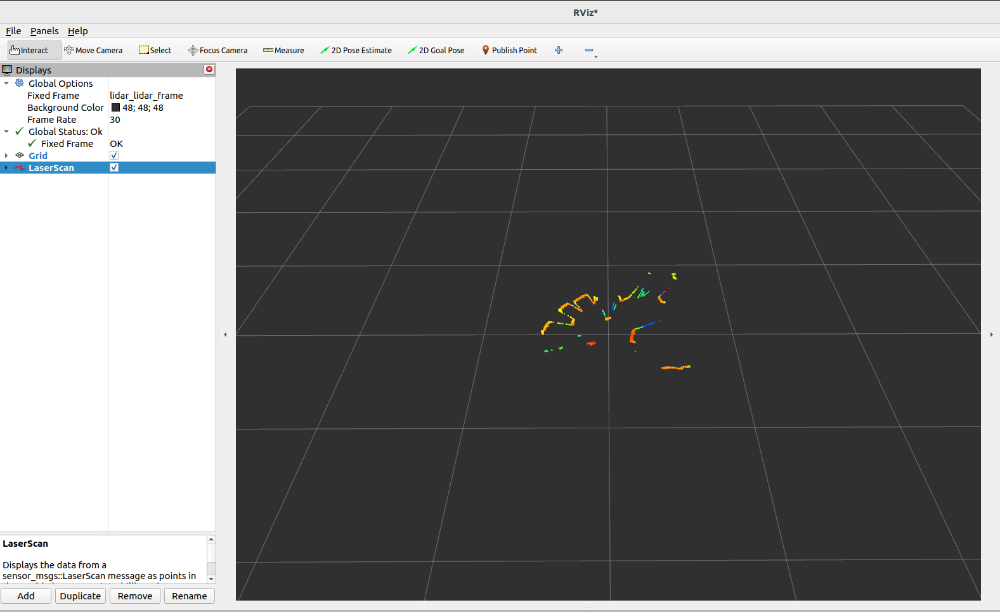

# OrbbecSDK ROS2 雷达驱动

此 ROS2 驱动程序支持您使用Orbbec 单线/多线 LiDAR，本文档提供安装说明、使用指南以及其他重要信息，帮助您快速上手使用该驱动程序。

## 1. 安装

### 1.1 先决条件

在使用 OrbbecSDK ROS2 LiDAR驱动程序之前，请确保您的系统上安装了以下依赖项：

- **ROS2**: 有效安装 ROS2（Humble、Foxy 或其他受支持的发行版）。
  - 如果您需要帮助，请参阅 [ROS2 安装指南](https://docs.ros.org/en/foxy/Installation.html).

### 1.2 安装 deb 依赖项

```bash
# assume you have sourced ROS environment, same blow
sudo apt install libgflags-dev nlohmann-json3-dev  \
ros-$ROS_DISTRO-image-transport ros-${ROS_DISTRO}-image-transport-plugins ros-${ROS_DISTRO}-compressed-image-transport \
ros-$ROS_DISTRO-image-publisher ros-$ROS_DISTRO-camera-info-manager \
ros-$ROS_DISTRO-diagnostic-updater ros-$ROS_DISTRO-diagnostic-msgs ros-$ROS_DISTRO-statistics-msgs \
ros-$ROS_DISTRO-backward-ros libdw-dev
```

### 1.3 安装 udev 规则

```bash
cd  ~/ros2_ws/src/OrbbecSDK_ROS2/orbbec_camera/scripts
sudo bash install_udev_rules.sh
sudo udevadm control --reload-rules && sudo udevadm trigger
```

### 2. 入门

```bash
cd ~/ros2_ws/
# build release, Default is Debug
colcon build --event-handlers  console_direct+  --cmake-args  -DCMAKE_BUILD_TYPE=Release
```

启动雷达节点

* 第一个终端

```bash
. ./install/setup.bash
ros2 launch orbbec_camera lidar.launch.py
```

* 第二个终端

```bash
. ./install/setup.bash
rviz2
```

1.打开Rviz2。

2.添加一个 `PointCloud2`或者 `LaserScan`显示。

3.`PointCloud2`选择 `/lidar/cloud/points`话题，`LaserScan`选择 `/lidar/scan/points`话题。

4.将 `Fixed Frame`设置为 `lidar_lidar_frame`，以正确对齐数据。

* `PointCloud2`示例可视化：


* `LaserScan`示例可视化：



## 2. 用法

### 2.1 运行驱动程序

要启动驱动程序，请启动提供的 ROS2 启动文件：

```bash
source install/setup.bash
# Launch the driver with point cloud data
ros2 launch orbbec_camera lidar.launch.py lidar_format:=LIDAR_POINT
# Launch the driver with sphere point cloud data
ros2 launch orbbec_camera lidar.launch.py lidar_format:=LIDAR_SPHERE_POINT
# Launch the driver with laser scan data
ros2 launch orbbec_camera lidar.launch.py lidar_format:=LIDAR_SCAN
```

此命令将启动与 Orbbec LiDAR 设备接口的节点。运行此命令前，请确保 LiDAR 硬件已正确连接。

### 2.2 获取已连接雷达的设备信息

```bash
ros2 run orbbec_camera list_devices_node
```

此命令将列出已连接的 LiDAR 设备，并显示它们各自的 IP 地址和端口。您可以使用这些信息来配置驱动程序以连接到特定设备。

### 2.3 检查雷达支持哪些配置

```bash
ros2 run orbbec_camera list_camera_profile_mode_node
```

### 2.4 参数和配置

`lidar.launch.py`文件包含驱动程序的默认参数。您可以通过修改启动文件或创建自定义配置文件来自定义这些设置。关键参数包括：

- **device_type**：启动的设备类型。可选的值：`lidar`、`camera`。该参数设置为 `lidar`则启动雷达设备，设置为 `camera`则启动相机设备。
- **camera_name**：启动节点命名空间。
- **device_num**：设备数量。如果需要启动多个设备，则必须填写此项。
- **upgrade_firmware**：固件升级功能。输入参数是固件路径。
- **connection_delay**：重新打开设备的延迟时间（以毫秒为单位）。并且在热插拔时立即重新打开设备可能会导致固件崩溃。
- **publish_tf**：启用 TF 发布。
- **tf_publish_rate**：TF 发布频率。
- **lidar_format**：雷达的数据格式。可选值：`LIDAR_POINT`、`LIDAR_SPHERE_POINT` 、`LIDAR_SCAN`
- **lidar_rate**：雷达的扫描速率。
- **repetitive_scan_mode**：重复扫描模式参数。
- **filter_level**：添加过滤等级参数。
- **vertical_fov**：垂直角度参数。
- **min_angle**：雷达扫描范围的最小角度，以度为单位（例如 `-135.0`）。默认值：`-135.0`。
- **max_angle**：雷达扫描范围的最大角度，以度为单位（例如 `135.0`）。默认值：`135.0`。
- **min_range**：雷达可测量的最小距离，以米为单位。默认值：`0.05`。
- **max_range**：雷达可测量的最大距离，以米为单位。默认值：`30.0`。
- **echo_mode**：雷达的回波模式。可选值：`Last Echo`，`First Echo`
- **point_cloud_qos**：ROS 2 消息服务质量 (QoS) 设置。可能的值包括 `SYSTEM_DEFAULT`、`DEFAULT`、`PARAMETER_EVENTS`、`SERVICES_DEFAULT`、`PARAMETERS` 和 `SENSOR_DATA`，并且不区分大小写。这些值分别对应于 `rmw_qos_profile_system_default`、`rmw_qos_profile_default`、`rmw_qos_profile_parameter_events`、`rmw_qos_profile_services_default`、`rmw_qos_profile_parameters` 和 `SENSOR_DATA`。
- **enumerate_net_device**：启用自动枚举网络设备。
- **net_device_ip**：网络设备的IP地址。
- **net_device_port**：网络这边的端口号。
- **log_level**：SDK日志级别，默认值为 `none`，可选值为 `debug`、`info`、`warn`、`error`、`fatal`
- **time_domain**：设备的时间戳类型。可选值为 `device`、`global`、`system`
- **config_file_path**：YAML 配置文件的路径。默认值为“”。如果未指定配置文件，则将使用启动文件中的默认参数。
- **enable_heartbeat**：启用心跳功能，默认为 `false`。如果设置为 `true`，摄像头节点将向固件发送心跳信号；如果需要硬件日志记录，也应设置为 `true`。

## pointcloud data 详细说明

Livox pointcloud2 （PointXYZRT） 点云格式，如下：

```
float32 x               # X axis, unit:m
float32 y               # Y axis, unit:m
float32 z               # Z axis, unit:m
uint8 reflectivity      # lidar reflectivity
uint8   tag             # lidar tag
```
