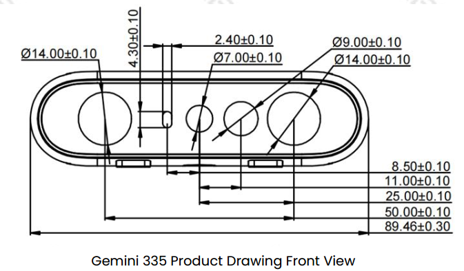
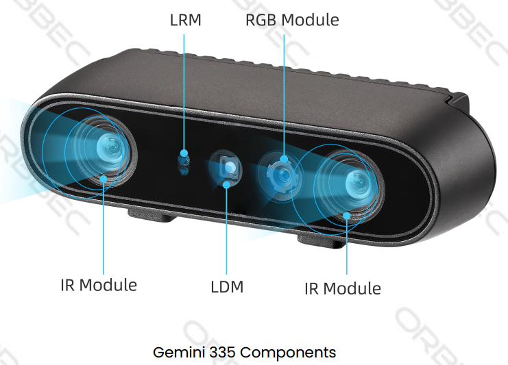

## Coordinate Systems and TF Transforms

### Camera sensor structure





### ROS2 Robot Coordinate System vs Camera Optical Coordinate System

* Point of View:
  * Imagine standing behind the camera and looking forward.
  * Always use this point of view when discussing coordinates, left vs right IR, sensor positions, etc.


* ROS2 Coordinate System: (X: Forward, Y: Left, Z: Up)
* Camera Optical Coordinate System: (X: Right, Y: Down, Z: Forward)
* All data published in the wrapper topics is optical data taken directly from the camera sensors.
* Static and dynamic TF topics publish optical and ROS coordinate systems so users can transform between them.

### Using ROS2 TF Tools

#### View TF Tree Structure

Use the following ROS2 commands to print and visualize the TF tree published by the camera package:

**Print all TF relationships:**

```bash
ros2 run tf2_tools view_frames
```

This command generates a `frames.pdf` file showing the hierarchy between all frames.


**View all currently published TF information:**

```bash
ros2 topic echo /tf_static
```

**View the TF transform between two specified frames:**

Use the following command to view the transform between two specific frames:

```bash
ros2 run tf2_ros tf2_echo [source_frame] [target_frame]
```

Example, view transform from `camera_link` to `camera_depth_optical_frame`:

```bash
ros2 run tf2_ros tf2_echo camera_link camera_depth_optical_frame
```

The command continuously outputs the real-time transform between the two frames, including:

- Translation: x, y, z (meters)
- Rotation (Quaternion): x, y, z, w
- Rotation (RPY): roll, pitch, yaw (radians and degrees)
- Transform Matrix: 4×4 matrix with rotation and translation

Sample output:

```
At time 0.0
- Translation: [0.000, 0.000, 0.000]
- Rotation: in Quaternion [-0.500, 0.500, -0.500, 0.500]
- Rotation: in RPY (radian) [-1.571, -0.000, -1.571]
- Rotation: in RPY (degree) [-90.000, -0.000, -90.000]
- Matrix:
  0.000  0.000  1.000  0.000
 -1.000  0.000  0.000  0.000
  0.000 -1.000  0.000  0.000
  0.000  0.000  0.000  1.000
```

#### Visualize TF Tree in rviz2

Use rviz2 to visualize the TF tree and relative frame poses in real time:

```bash
rviz2
```

In rviz2:

- Add the `TF` display plugin
- Set the Fixed Frame to `camera_link` or `camera_depth_optical_frame`
- Select which TF frames to display


### Camera TF Calculation and Publishing Mechanism

#### Core Function: [OBCameraNode::calcAndPublishStaticTransform()](https://github.com/orbbec/OrbbecSDK_ROS2/blob/166c35b4ea211c60265ca9b38b1b15519d1ea3dd/orbbec_camera/src/ob_camera_node.cpp#L3475)

The camera node uses this function to calculate and publish all static transforms between sensors.

```cpp
void OBCameraNode::calcAndPublishStaticTransform() {
  tf2::Quaternion quaternion_optical, zero_rot;
  zero_rot.setRPY(0.0, 0.0, 0.0);
  quaternion_optical.setRPY(-M_PI / 2, 0.0, -M_PI / 2);
  tf2::Vector3 zero_trans(0, 0, 0);
  auto base_stream_profile = stream_profile_[base_stream_];
  auto device_info = device_->getDeviceInfo();
  CHECK_NOTNULL(device_info);
  auto pid = device_info->getPid();
  if (!base_stream_profile) {
    RCLCPP_ERROR_STREAM(logger_, "Failed to get base stream profile");
    return;
  }
  CHECK_NOTNULL(base_stream_profile.get());
  for (const auto &item : stream_profile_) {
    auto stream_index = item.first;

    auto stream_profile = item.second;
    if (!stream_profile) {
      continue;
    }
    OBExtrinsic ex;
    try {
      ex = stream_profile->getExtrinsicTo(base_stream_profile);
    } catch (const ob::Error &e) {
      RCLCPP_ERROR_STREAM(logger_, "Failed to get " << stream_name_[stream_index]
                                                    << " extrinsic: " << e.getMessage());
      ex = OBExtrinsic({{1, 0, 0, 0, 1, 0, 0, 0, 1}, {0, 0, 0}});
    }

    auto Q = rotationMatrixToQuaternion(ex.rot);
    Q = quaternion_optical * Q * quaternion_optical.inverse();
    tf2::Vector3 trans(ex.trans[0], ex.trans[1], ex.trans[2]);
    auto timestamp = node_->now();
    if (stream_index.first != base_stream_.first) {
      if (stream_index.first == OB_STREAM_IR_RIGHT && base_stream_.first == OB_STREAM_DEPTH) {
        trans[0] = std::abs(trans[0]);  // because left and right ir calibration is error
      }
      publishStaticTF(timestamp, trans, Q, frame_id_[base_stream_], frame_id_[stream_index]);
    }
    publishStaticTF(timestamp, zero_trans, quaternion_optical, frame_id_[stream_index],
                    optical_frame_id_[stream_index]);
    RCLCPP_INFO_STREAM(logger_, "Publishing static transform from " << stream_name_[stream_index]
                                                                    << " to "
                                                                    << stream_name_[base_stream_]);
    RCLCPP_INFO_STREAM(logger_, "Translation " << trans[0] << ", " << trans[1] << ", " << trans[2]);
    RCLCPP_INFO_STREAM(logger_, "Rotation " << Q.getX() << ", " << Q.getY() << ", " << Q.getZ()
                                            << ", " << Q.getW());
  }

  if ((pid == FEMTO_BOLT_PID || pid == FEMTO_MEGA_PID) && enable_stream_[DEPTH] &&
      enable_stream_[COLOR] && enable_publish_extrinsic_) {
    // calc depth to color

    CHECK_NOTNULL(stream_profile_[COLOR]);
    auto depth_to_color_extrinsics = base_stream_profile->getExtrinsicTo(stream_profile_[COLOR]);
    auto Q = rotationMatrixToQuaternion(depth_to_color_extrinsics.rot);
    Q = quaternion_optical * Q * quaternion_optical.inverse();
    publishStaticTF(node_->now(), zero_trans, Q, camera_link_frame_id_, frame_id_[base_stream_]);
  } else {
    publishStaticTF(node_->now(), zero_trans, zero_rot, camera_link_frame_id_,
                    frame_id_[base_stream_]);
  }

  if (enable_stream_[DEPTH] && enable_stream_[COLOR] && enable_publish_extrinsic_) {
    static const char *frame_id = "depth_to_color_extrinsics";
    OBExtrinsic ex;
    try {
      ex = base_stream_profile->getExtrinsicTo(stream_profile_[COLOR]);
    } catch (const ob::Error &e) {
      RCLCPP_ERROR_STREAM(logger_,
                          "Failed to get " << frame_id << " extrinsic: " << e.getMessage());
      ex = OBExtrinsic({{1, 0, 0, 0, 1, 0, 0, 0, 1}, {0, 0, 0}});
    }
    depth_to_other_extrinsics_[COLOR] = ex;
    auto ex_msg = obExtrinsicsToMsg(ex, frame_id);
    CHECK_NOTNULL(depth_to_other_extrinsics_publishers_[COLOR]);
    depth_to_other_extrinsics_publishers_[COLOR]->publish(ex_msg);
  }

  if (enable_stream_[DEPTH] && enable_stream_[INFRA0] && enable_publish_extrinsic_) {
    static const char *frame_id = "depth_to_ir_extrinsics";
    OBExtrinsic ex;
    try {
      ex = base_stream_profile->getExtrinsicTo(stream_profile_[INFRA0]);
    } catch (const ob::Error &e) {
      RCLCPP_ERROR_STREAM(logger_,
                          "Failed to get " << frame_id << " extrinsic: " << e.getMessage());
      ex = OBExtrinsic({{1, 0, 0, 0, 1, 0, 0, 0, 1}, {0, 0, 0}});
    }
    depth_to_other_extrinsics_[INFRA0] = ex;
    auto ex_msg = obExtrinsicsToMsg(ex, frame_id);
    CHECK_NOTNULL(depth_to_other_extrinsics_publishers_[INFRA0]);
    depth_to_other_extrinsics_publishers_[INFRA0]->publish(ex_msg);
  }
  if (enable_stream_[DEPTH] && enable_stream_[INFRA1] && enable_publish_extrinsic_) {
    static const char *frame_id = "depth_to_left_ir_extrinsics";
    OBExtrinsic ex;
    try {
      ex = base_stream_profile->getExtrinsicTo(stream_profile_[INFRA1]);
    } catch (const ob::Error &e) {
      RCLCPP_ERROR_STREAM(logger_,
                          "Failed to get " << frame_id << " extrinsic: " << e.getMessage());
      ex = OBExtrinsic({{1, 0, 0, 0, 1, 0, 0, 0, 1}, {0, 0, 0}});
    }
    depth_to_other_extrinsics_[INFRA1] = ex;
    auto ex_msg = obExtrinsicsToMsg(ex, frame_id);
    CHECK_NOTNULL(depth_to_other_extrinsics_publishers_[INFRA1]);
    depth_to_other_extrinsics_publishers_[INFRA1]->publish(ex_msg);
  }
  if (enable_stream_[DEPTH] && enable_stream_[INFRA2] && enable_publish_extrinsic_) {
    static const char *frame_id = "depth_to_right_ir_extrinsics";
    OBExtrinsic ex;
    try {
      ex = base_stream_profile->getExtrinsicTo(stream_profile_[INFRA2]);
    } catch (const ob::Error &e) {
      RCLCPP_ERROR_STREAM(logger_,
                          "Failed to get " << frame_id << " extrinsic: " << e.getMessage());
      ex = OBExtrinsic({{1, 0, 0, 0, 1, 0, 0, 0, 1}, {0, 0, 0}});
    }
    ex.trans[0] = -std::abs(ex.trans[0]);
    depth_to_other_extrinsics_[INFRA2] = ex;
    auto ex_msg = obExtrinsicsToMsg(ex, frame_id);
    CHECK_NOTNULL(depth_to_other_extrinsics_publishers_[INFRA2]);
    depth_to_other_extrinsics_publishers_[INFRA2]->publish(ex_msg);
  }
  if (enable_stream_[DEPTH] && enable_stream_[ACCEL] && enable_publish_extrinsic_) {
    static const char *frame_id = "depth_to_accel_extrinsics";
    OBExtrinsic ex;
    try {
      ex = base_stream_profile->getExtrinsicTo(stream_profile_[ACCEL]);
    } catch (const ob::Error &e) {
      RCLCPP_ERROR_STREAM(logger_,
                          "Failed to get " << frame_id << " extrinsic: " << e.getMessage());
      ex = OBExtrinsic({{1, 0, 0, 0, 1, 0, 0, 0, 1}, {0, 0, 0}});
    }
    depth_to_other_extrinsics_[ACCEL] = ex;
    auto ex_msg = obExtrinsicsToMsg(ex, frame_id);
    CHECK_NOTNULL(depth_to_other_extrinsics_publishers_[ACCEL]);
    depth_to_other_extrinsics_publishers_[ACCEL]->publish(ex_msg);
  }
  if (enable_stream_[DEPTH] && enable_stream_[GYRO] && enable_publish_extrinsic_) {
    static const char *frame_id = "depth_to_gyro_extrinsics";
    OBExtrinsic ex;
    try {
      ex = base_stream_profile->getExtrinsicTo(stream_profile_[GYRO]);
    } catch (const ob::Error &e) {
      RCLCPP_ERROR_STREAM(logger_,
                          "Failed to get " << frame_id << " extrinsic: " << e.getMessage());
      ex = OBExtrinsic({{1, 0, 0, 0, 1, 0, 0, 0, 1}, {0, 0, 0}});
    }
    depth_to_other_extrinsics_[GYRO] = ex;
    auto ex_msg = obExtrinsicsToMsg(ex, frame_id);
    CHECK_NOTNULL(depth_to_other_extrinsics_publishers_[GYRO]);
    depth_to_other_extrinsics_publishers_[GYRO]->publish(ex_msg);
  }
  if (enable_sync_output_accel_gyro_) {
    tf2::Quaternion zero_rot;
    zero_rot.setRPY(0.0, 0.0, 0.0);
    tf2::Vector3 zero_trans(0, 0, 0);
    publishStaticTF(node_->now(), zero_trans, zero_rot, optical_frame_id_[GYRO],
                    accel_gyro_frame_id_);
  }
}
```

#### Function Breakdown

Detailed explanation of the code:

**Quaternion Initialization and Coordinate Transform**

```cpp
tf2::Quaternion quaternion_optical, zero_rot;
zero_rot.setRPY(0.0, 0.0, 0.0);
quaternion_optical.setRPY(-M_PI / 2, 0.0, -M_PI / 2);
```

- `quaternion_optical`: Defines the rotation from optical coordinates to ROS standard (90° rotation)
- Converts camera optical CS (X right, Y down, Z forward) to ROS CS (X forward, Y left, Z up)

**Get Device Info and Base Stream**

```cpp
auto base_stream_profile = stream_profile_[base_stream_];
auto device_info = device_->getDeviceInfo();
// Base stream usually DEPTH
```

- Choose a base stream (usually depth); all other transforms are relative to it

**Iterate Streams and Compute Relative Transforms**

```cpp
for (const auto &item : stream_profile_) {
    auto stream_index = item.first;
    auto stream_profile = item.second;
    OBExtrinsic ex;
    ex = stream_profile->getExtrinsicTo(base_stream_profile);
    auto Q = rotationMatrixToQuaternion(ex.rot);
    Q = quaternion_optical * Q * quaternion_optical.inverse();
    tf2::Vector3 trans(ex.trans[0], ex.trans[1], ex.trans[2]);
```

- `OBExtrinsic` holds rotation matrix (`rot`) and translation vector (`trans`)
- Apply optical-to-ROS rotation via quaternion multiplication

**Publish TF Transforms**

```cpp
publishStaticTF(timestamp, trans, Q, frame_id_[base_stream_], frame_id_[stream_index]);
publishStaticTF(timestamp, zero_trans, quaternion_optical, frame_id_[stream_index],
                optical_frame_id_[stream_index]);
```

- First: base stream to sensor (translation + rotation)
- Second: sensor frame to optical frame (pure rotation)

**Special Handling for Left/Right IR**

```cpp
if (stream_index.first == OB_STREAM_IR_RIGHT && base_stream_.first == OB_STREAM_DEPTH) {
    trans[0] = std::abs(trans[0]);
}
```

- Ensures symmetry consistency between left/right IR cameras

**Publish Depth-to-Other Extrinsics**

```cpp
if (enable_stream_[DEPTH] && enable_stream_[COLOR] && enable_publish_extrinsic_) {
    OBExtrinsic ex = base_stream_profile->getExtrinsicTo(stream_profile_[COLOR]);
    auto ex_msg = obExtrinsicsToMsg(ex, "depth_to_color_extrinsics");
    depth_to_other_extrinsics_publishers_[COLOR]->publish(ex_msg);
}
```

- Publishes raw extrinsics via topic for advanced alignment and registration
