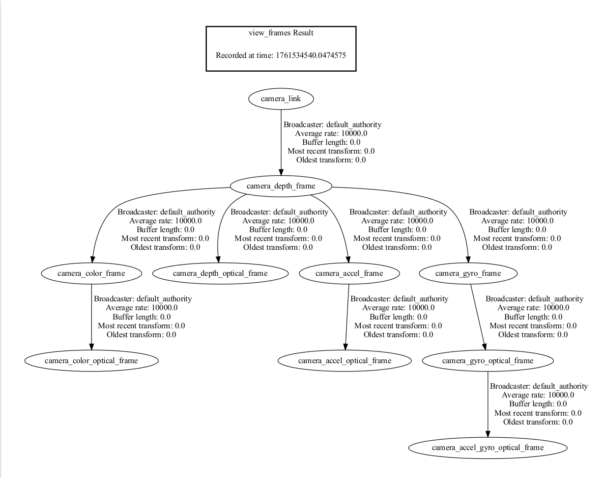
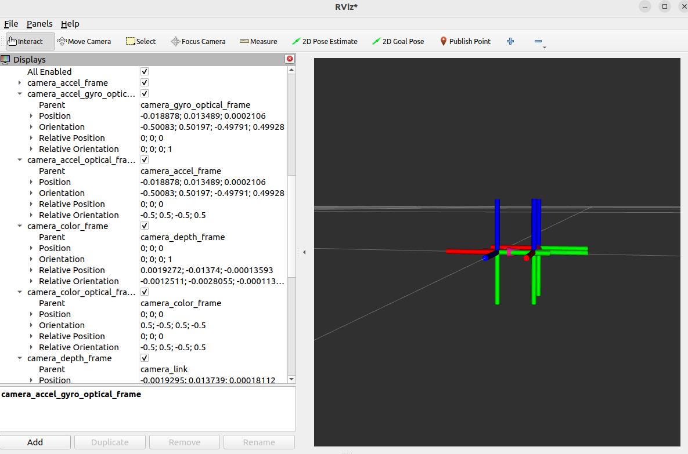

### ROS2 Robot vs Camera Optical Coordination Systems

* Point Of View:
  * Imagine we are standing behind of the camera, and looking forward.
  * Always use this point of view when talking about coordinates, left vs right IRs, position of sensor, etc..


* ROS2 Coordinate System: (X: Forward, Y:Left, Z: Up)
* Camera Optical Coordinate System: (X: Right, Y: Down, Z: Forward)
* All data published in our wrapper topics is optical data taken directly from our camera sensors.
* static and dynamic TF topics publish optical CS and ROS CS to give the user the ability to move from one CS to other CS.

### Using ROS2 TF Tools

#### Viewing the TF Tree Structure

You can use the following ROS2 commands to print and visualize the TF tree published by the camera package:

**Print all TF relationships:**

```bash
ros2 run tf2_tools view_frames
```

This command generates a `frames.pdf` file that displays the hierarchical relationships between all frames.



**View all currently published TF information:**

```bash
ros2 topic echo /tf_static
```

#### Visualizing TF Tree with rviz2

You can use rviz2 to visualize the TF tree structure and relative positions of coordinate systems in real-time:

```bash
rviz2
```

In rviz2:

- Add the `TF` display plugin
- Configure the Fixed Frame to `camera_link` or `camera_depth_optical_frame`
- Select the TF frames to display



### Camera TF Calculation and Publishing Mechanism

#### Core Function: `OBCameraNode::calcAndPublishStaticTransform()`

The camera node calculates and publishes static transformation relationships between all sensors through this function. Below is a detailed explanation of the code:

#### Quaternion Initialization and Coordinate System Transformation

```cpp
tf2::Quaternion quaternion_optical, zero_rot;
zero_rot.setRPY(0.0, 0.0, 0.0);
quaternion_optical.setRPY(-M_PI / 2, 0.0, -M_PI / 2);
```

**Explanation:**

- `quaternion_optical`: Defines the rotation transformation from the optical coordinate system to the ROS standard coordinate system (90-degree rotation)
- This rotation converts the camera optical coordinate system (X right, Y down, Z forward) to the ROS standard coordinate system (X forward, Y left, Z up)

#### Obtaining Device Information and Base Stream

```cpp
auto base_stream_profile = stream_profile_[base_stream_];
auto device_info = device_->getDeviceInfo();
// The base stream is typically the DEPTH stream
```

**Explanation:**

- A base stream (typically the depth stream) is selected, and all other sensor transformations are calculated relative to this base stream

#### Iterating Through All Streams and Calculating Relative Transformations

```cpp
for (const auto &item : stream_profile_) {
    auto stream_index = item.first;
    auto stream_profile = item.second;

    // Get the extrinsics of this stream relative to the base stream
    OBExtrinsic ex;
    ex = stream_profile->getExtrinsicTo(base_stream_profile);

    // Convert rotation matrix to quaternion
    auto Q = rotationMatrixToQuaternion(ex.rot);

    // Apply optical coordinate system transformation: Q_new = quaternion_optical * Q * quaternion_optical.inverse()
    Q = quaternion_optical * Q * quaternion_optical.inverse();

    tf2::Vector3 trans(ex.trans[0], ex.trans[1], ex.trans[2]);
```

**Explanation:**

- `OBExtrinsic` contains the rotation matrix (`rot`) and translation vector (`trans`) between two sensors
- Quaternion multiplication applies the optical coordinate system transformation to each sensor's rotation relationship
- This transformation converts the camera's native optical coordinate system to the ROS standard coordinate system

#### Publishing TF Transformations

```cpp
// Publish the transformation from sensor to base stream (in ROS coordinate system)
publishStaticTF(timestamp, trans, Q, frame_id_[base_stream_], frame_id_[stream_index]);

// Publish the transformation from physical frame to its optical frame
publishStaticTF(timestamp, zero_trans, quaternion_optical, frame_id_[stream_index],
                optical_frame_id_[stream_index]);
```

**Explanation:**

- First `publishStaticTF`: Publishes the transformation from the base stream to the current sensor (translation + rotation)
- Second `publishStaticTF`: Publishes the transformation from physical frame to optical frame (pure rotation, no translation)
- `frame_id_[stream_index]`: Physical coordinate system frame name (e.g., `camera_depth_frame`)
- `optical_frame_id_[stream_index]`: Optical coordinate system frame name (e.g., `camera_depth_optical_frame`)

#### Special Handling for Left and Right IR Cameras

```cpp
if (stream_index.first == OB_STREAM_IR_RIGHT && base_stream_.first == OB_STREAM_DEPTH) {
    trans[0] = std::abs(trans[0]);
}
```

**Explanation:**

- Left and right IR cameras are symmetric about the center plane in the device coordinate system
- Using `abs()` ensures the X-axis offset is positive, maintaining geometric consistency

#### Publishing Extrinsics from Depth to Other Sensors

```cpp
if (enable_stream_[DEPTH] && enable_stream_[COLOR] && enable_publish_extrinsic_) {
    OBExtrinsic ex = base_stream_profile->getExtrinsicTo(stream_profile_[COLOR]);
    auto ex_msg = obExtrinsicsToMsg(ex, "depth_to_color_extrinsics");
    depth_to_other_extrinsics_publishers_[COLOR]->publish(ex_msg);
}
```

**Explanation:**

- In addition to publishing transformation relationships through TF, raw extrinsic parameters are also published through custom topics
- This allows users to directly access the camera's intrinsic and extrinsic parameters for high-precision point cloud alignment and depth-color registration
