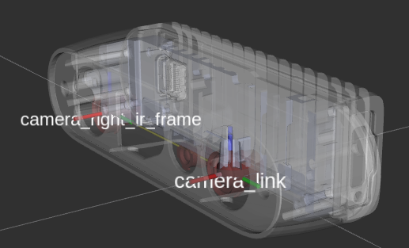

### TF from coordinate A to coordinate B:

In Orbbec cameras, the origin point (0,0,0) is taken from the camera_link position

Our wrapper provide static TFs between each sensor coordinate to the camera base (camera_link)

Also, it provides TFs from each sensor ROS coordinates to its corrosponding optical coordinates.

Example of static TFs of RGB sensor and right infra sensor of Gemini335 module as it shown in rviz2:

```bash
ros2 launch orbbec_description view_model.launch.py model:=gemini_335_336.urdf.xacro
```


