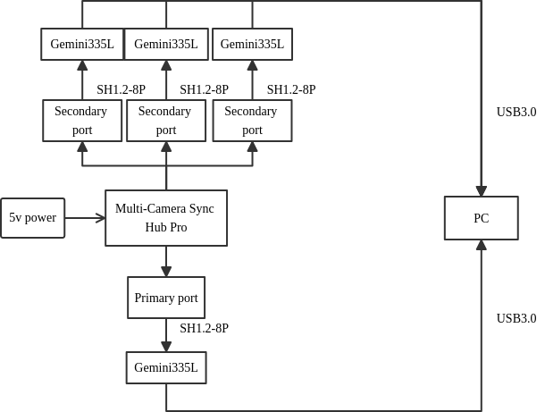
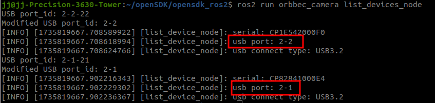
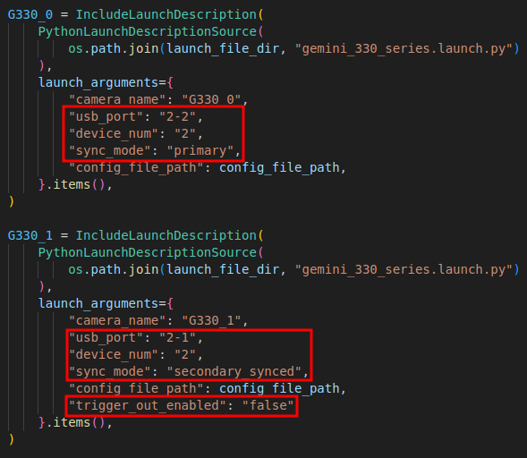
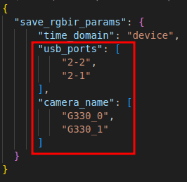
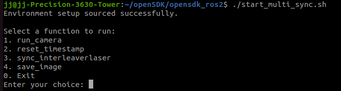

## 多机同步存图及脚本解析

本节介绍如何在ROS 2环境中使用多个Orbbec摄像头同步存图，并使用脚本解析数据。

### 连接准备

请根据指导连接多个Orbbec摄像头和多机同步器。

* 有关多机同步器的详细指导，请参阅[设置相机进行外部同步](https://www.orbbec.com/docs/set-up-cameras-for-external-synchronization_v1-2/)。
* 多个Orbbec摄像头和多机同步器的连接示例。



### 多机同步存图

#### 查看设备的USB端口

```bash
ros2 run orbbec_camera list_devices_node
```



#### 参数配置

##### multi_camera_synced.launch.py

1. `usb_port` 设置为设备的USB端口。
2. `device_num` 设置为2，说明启动了两个相机。
3. `sync_mode` 设置为 primary，说明相机设备设置为主机模式。
4. 从机设置 `trigger_out_enabled` 为 false。



##### multi_save_rgbir_params.json

配置多个设备的USB端口和名称。



##### camera_params.yaml

启用左IR摄像头。

`enable_left_ir: true`

##### start_multi_sync.sh

`{data: 100}` 表示每台相机的每个流存储100张图片。


#### 启动多机同步存图

启动多个Orbbec摄像头（选择1）。

* 终端1

```bash
cd  ~/ros2_ws/src/OrbbecSDK_ROS2/orbbec_camera/tools
sudo chmod +x start_multi_sync.sh
bash start_multi_sync.sh
```



同步保存图片（选择4）。

* 终端2

```bash
cd  ~/ros2_ws/src/OrbbecSDK_ROS2/orbbec_camera/tools
bash start_multi_sync.sh
```

### 脚本解析

`multicamera_sync` - 保存图片以及解析脚本存放目录。

* `ouput` - 保存图片目录
* `Python` - 解析脚本目录

注意：`multicamera_sync` 需要复制到当前工作空间目录（与 `install` 目录同级）。

#### 配置文件

* `Config.ini` 配置相机实际帧率和最大误差时间戳阈值。
* `DevicesInfo.txt` 配置相机数量以及相机的pid、vid、SN号等参数。
* `StreamProfileInfo.txt` 配置相机分辨率、帧率以及编码格式。

注意：`DevicesInfo.txt` 和 `StreamProfileInfo.txt` 是解析脚本所需要的文件，需要复制到 `TotalModeFrames` 文件夹同级目录（ `TotalModeFrames` 目录由存图脚本创建，用于存储多相机同步采集的图像数据）。

#### 运行脚本

运行解析脚本解析多机同步存储的图片。

```bash
cd  ~/ros2_ws/multicamera_sync/Python
python3 SyncFramesMain.py
```

#### 输出结果

* `matchFrames`：同一组摄像头不完整的数据集，存在摄像头图片信息缺失。
* `notMatchFrames`：同一组摄像头完整的数据集。
* `abnormal`：同一组摄像头完整的数据集，且相机同步时间超过 `Config.ini` 设置的参数 `tspRangeThreshold`。
