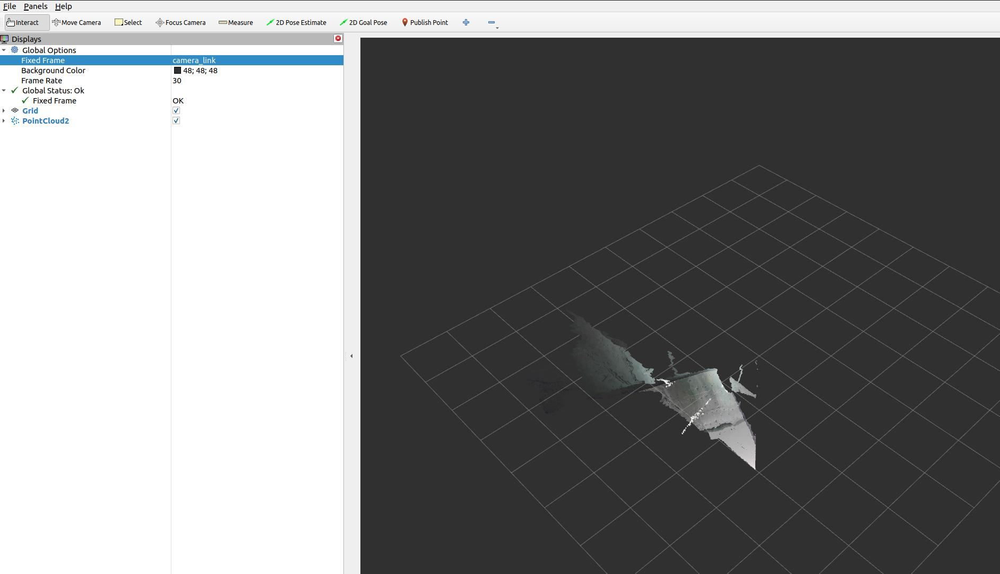

## 在ROS 2中启用和可视化点云

本节演示如何从相机节点启用点云数据输出，并使用RViz2进行可视化，类似于之前讨论的[启动相机节点](./start_camera_node.MD)文档中的初始相机节点设置。

### 启用深度点云

#### 启用深度点云的命令

要激活深度信息的点云数据流，请使用以下命令：

```bash
ros2 launch orbbec_camera gemini_330_series.launch.py enable_point_cloud:=true
```

#### 在RViz2中可视化深度点云

运行上述命令后，执行以下步骤来可视化深度点云：

1. 打开RViz2。
2. 添加一个`PointCloud2`显示。
3. 选择`/camera/depth/points`主题进行可视化。
4. 将固定帧设置为`camera_link`以正确对齐数据。

##### 示例可视化

以下是在RViz2中可能看到的深度点云的样子：


### 启用彩色点云

#### 启用彩色点云的命令

要启用彩色点云功能，请输入以下命令：

```bash
ros2 launch orbbec_camera gemini_330_series.launch.py enable_colored_point_cloud:=true
```

#### 在RViz2中可视化彩色点云

要可视化彩色点云数据：

1. 在执行命令后启动RViz2。
2. 添加一个`PointCloud2`显示面板。
3. 从列表中选择`/camera/depth_registered/points`主题。
4. 确保固定帧设置为`camera_link`。

##### 示例可视化

在RViz2中彩色点云的结果应类似于这样：

