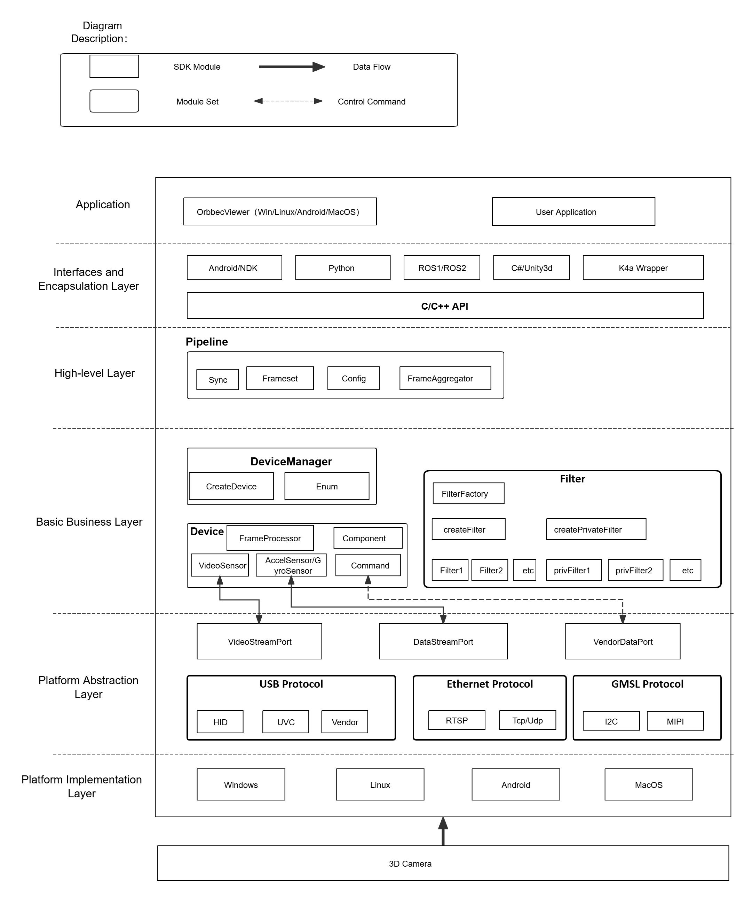
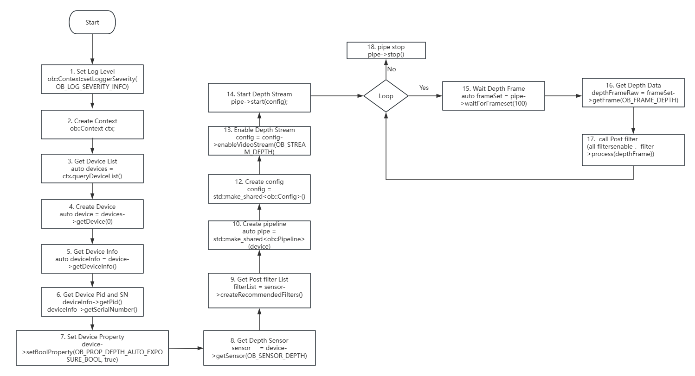
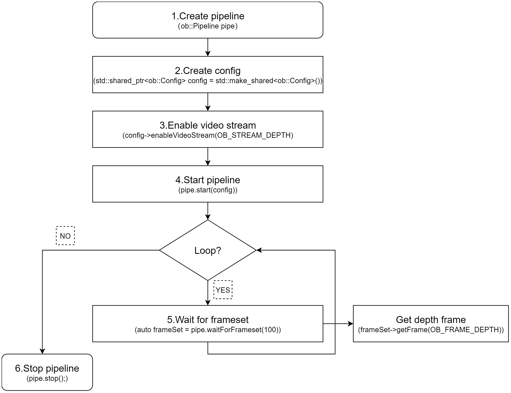

# Orbbec SDK Overview

This section introduces the Orbbec SDK in C++. Its architecture and concepts are consistent with those of the Python Wrapper.

## Terms

|  ID  |  Name  |  Explain  |
| --- | --- | --- |
|  1  |  USB  |  Universal Serial Bus  |
|  2  |  UVC  |  USB Video Class  |
|  3  |  Firmware  |  Firmware of 3D camera  |
|  4  |  Disparity  |  Disparity is to observe the direction difference of the same target from two points with a certain distance.  |
|  5  |  D2D (Disparity to depth)  |  Disparity to depth is an image processing technique used to convert disparity information into depth information.  |
|  6  |  Hardware D2D  |  Disparity to depth is implemented internally in the device, without occupying the computational power of the host computer.  |
|  7  |  Software D2D  |  Disparity to depth, implemented in Orbbec SDK  |
|  8  |  Depth point cloud  |  Depth point cloud, the coordinates of points in a three-dimensional world coordinate system, can be transformed into a point cloud using the intrinsic parameters of a Depth camera.  |
|  9  |  RGBD point cloud  |  Point cloud with overlaid RGB information  |
|  10  |  D2C  |  The translation of "Depth to Color" is a feature that performs per-pixel geometric transformation on a depth image. Its result is aligning the depth image with its corresponding color image through the D2C transformation, allowing us to locate the depth information of a color pixel by using the same image coordinate position of that pixel in the transformed depth image. After the D2C transformation, we generate a depth image of the same size as the target color image, where the image content represents depth data in the coordinate system of the color camera. In other words, it reconstructs a depth image "captured" using the origin and dimensions of the color camera, where each pixel matches the corresponding pixel coordinates of the color camera.  |
|  11  |  Hardware D2C  |  Hardware D2C refers to the functionality of performing Depth to Color transformation within the camera itself, with the camera directly outputting the result of the D2C transformation.  |
|  12  |  Software D2C  |  Performing D2C computation on the host computer side using an SDK.  |
|  13  |  Frame aggregation (FrameSet)  |  Combining Depth, IR, and Color frames into a Frameset and invoking it through a pipeline.  |
|  14  |  C2D  |  The translation of "Color to Depth" is a feature that performs per-pixel geometric transformation on a color image. Its result is aligning the color image with its corresponding depth image through the C2D transformation.  |
|  15  |  MetaData  |  Frame metadata is a set of parameters (or attributes) that provide a snapshot of the sensor configuration and/or system state present during the frame’s generation.   |
|  16  |  HDR  |  High Dynamic Range (HDR) imaging allows imaging systems to capture images in extremely dark and bright scenes alike. We propose a software solution running on the host CPU to implement this feature. It utilizes data from two consecutive frames and directly synthesizes these two depth images, thereby enhances the dynamic range of 16-bit depth images.  |
|  17  |  LDP  |  Laser close-range protection  |
|   |   |   |

## Orbbec SDK v2 Architecture Overview

- Application

OrbbecViewer, Sample, and User Application Implementation.

- Interfaces and Encapsulation Layer

OrbbecSDK Interface Encapsulation and Wrapper Encapsulation.

- High-level Layer

HighLevel encapsulates the core business components and provides interfaces to the outside using a pipeline.

- Basic business layer

The realization of the core business logic framework.

- Platform abstraction layer

Cross-platform components abstract operating system differences and provide a unified access interface.

- Platform implementation layer 

The driver implementation of each platform.

## SDK Concept Overview

- Context
    

Context which provides a set of settings includes settings such as device state change callbacks, log levels, and more. The Context can access multiple devices.

- Device
    

One actual hardware device corresponds to one Device object, which is used to obtain relevant information of the device and control its attributes.

- Pipeline
    

The HighLevel corresponding object encapsulates the interface for quick access to the SDK. It has simple functions that allow users to quickly get started and use the SDK.

- Config
    

Provides configuration for enabling data streams, alignment modes, and frame aggregation modes,  It is used to control the behavior of the data output. 

- StreamProfile 
    

Stream configuration that defines parameters such as resolution, frame rate, and encoding format, It also provides management of camera parameters.

- Frame
    

Represents a frame of data in the Stream, and also contains relevant information about that frame of data, such as timestamp, type, etc.

- Filter
    

It mainly refers to some algorithmic processing modules for the composite stream FrameSet, such as point cloud algorithm processing.

- Record
    

Recording functionality that captures data streams and saves them as files for later analysis or playback.

- Playback
    

Playback functionality that plays recorded files and supports control over playback speed and other related parameters.

## SDK Programming Model

Here is the C++ programming logic flow chart. Python's programming logic is the same as it.

- Standard Flowchart:

The standard flowchart demonstrates how to create a device from the device list, set and get parameters, and apply post-processing filters.

- Flowchart using default configuration (stream acquisition based on the default settings in OrbbecSDKConfig.xml):

