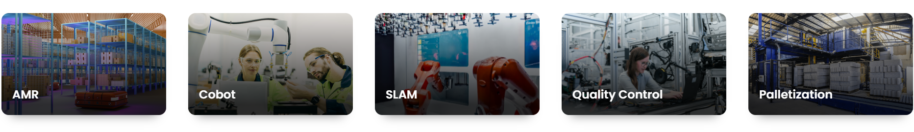
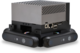

&nbsp;

# Typical applications

OrbbecSDK_ROS2 is a wrapper for the Orbbec 3D camera that provides seamless integration with the ROS2 environment. It
supports ROS2 Foxy, Humble, and Jazzy distributions.

**Applications scenarios:**

* Depth Sensing
* Object Detection
* Body Tracking
* Positional Tracking
* Geo Tracking
* Spatial Mapping
* Camera Control
* Plane Detection
* Multi Camera Fusion
* [OPDK ](https://www.orbbec.com/opdk/)

&nbsp;
