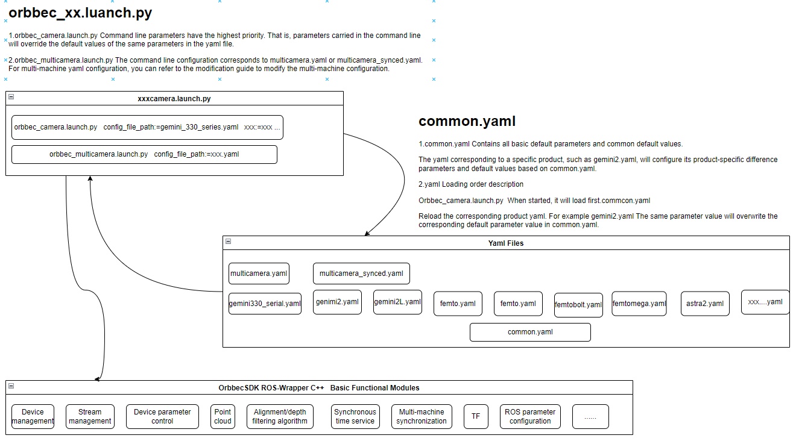
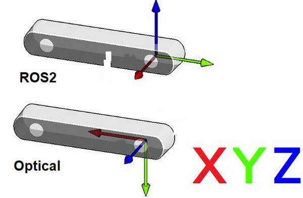
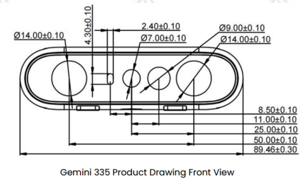
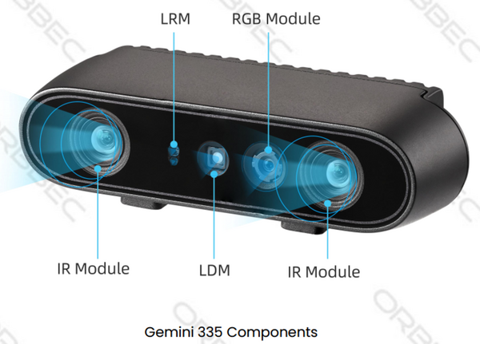

<!-- docs/source/2_installation/package_description.md -->

# Package  description

This section provides a detailed overview of the topics, services, launch scripts, and YAML configuration parameters encompassed within the OrbbecSDK_ROS2 package.

- Table of contents
  - [All available topics](#all-available-topics)
  - [All available services](#all-available-services)
  - [All available launch files](#all-available-launch-files)
  - [All available yaml files](#all-available-yaml-files)
  - [Coordinate systems](#coordinate-systems)
  - [Useful configurations](#useful-configurations)

## All available topics

When orbbec camera starts, it will, by default, publish the following topics:

| No. | Published topics                        | Type                                          | description                                                                                                                    |
| --- | :-------------------------------------- | :-------------------------------------------- | :----------------------------------------------------------------------------------------------------------------------------- |
| 1   | /camera/color/image_raw                 | [sensor_msgs/msg/Image]                       | The color stream image                                                                                                         |
| 2   | /camera/color/image_raw/compressed      | [sensor_msgs/msg/CompressedImage]             | The color stream image compressed                                                                                              |
| 3   | /camera/color/image_raw/compressedDepth | [sensor_msgs/msg/CompressedImage]             |                                                                                                                                |
| 4   | /camera/color/image_raw/theora          | [theora_image_transport/msg/Packet]           | The color image metadata                                                                                                       |
| 5   | /camera/color/metadata                  | [orbbec_camera_msgs/msg/Metadata]             |                                                                                                                                |
| 6   | /camera/depth/camera_info               | [sensor_msgs/msg/CameraInfo]                  | The depth camera information                                                                                                  |
| 7   | /camera/depth/image_raw                 | [sensor_msgs/msg/Image]                       | The depth stream image                                                                                                         |
| 8   | /camera/depth/image_raw/compressed      | [sensor_msgs/msg/CompressedImage]             | The depth stream image compressed                                                                                              |
| 9   | /camera/depth/image_raw/compressedDepth | [sensor_msgs/msg/CompressedImage]             |                                                                                                                                |
| 10  | /camera/depth/image_raw/theora          | [theora_image_transport/msg/Packet]           |                                                                                                                                |
| 11  | /camera/depth/metadata                  | [orbbec_camera_msgs/msg/Metadata]             | The depth image metadata                                                                                                       |
| 12  | /camera/left_ir/camera_info             | [sensor_msgs/msg/CameraInfo]                  | The left_ir camera information                                                                                               |
| 13  | /camera/left_ir/image_raw               | [sensor_msgs/msg/Image]                       | The left ir stream image                                                                                                      |
| 14  | /camera/left_ir/metadata                | [orbbec_camera_msgs/msg/Metadata]             |                                                                                                                                |
| 15  | /camera/right_ir/camera_info            | [sensor_msgs/msg/CameraInfo]                  | The right_ir camera information                                                                                              |
| 16  | /camera/right_ir/image_raw              | [sensor_msgs/msg/Image]                       | The right ir stream image                                                                                                     |
| 17  | /camera/right_ir/metadata               | [orbbec_camera_msgs/msg/Metadata]             |                                                                                                                                |
| 18  | /camera/ir/camera_info                  | [sensor_msgs/msg/CameraInfo]                  | The ir camera information                                                                                                    |
| 19  | /camera/ir/image_raw                    | [sensor_msgs/msg/Image]                       | The ir stream image                                                                                                           |
| 20  | /camera/depth/points                    | [sensor_msgs/msg/PointCloud2]                 | The point cloud, only available when `enable_point_cloud` is `true`                                                        |
| 21  | /camera/depth_filter_status             | [std_msgs/msg/String]                         | The depth filter status                                                                                                        |
| 22  | /camera/depth_registered/points         | [sensor_msgs/msg/PointCloud2]                 | The colored point cloud, only available when `enable_colored_point_cloud` is `true`.                                       |
| 23  | /camera/depth_to_color                  | [orbbec_camera_msgs/msg/Extrinsics]           |                                                                                                                                |
| 24  | /camera/depth_to_left_ir                | [orbbec_camera_msgs/msg/Extrinsics]           |                                                                                                                                |
| 25  | /camera/depth_to_right_ir               | [orbbec_camera_msgs/msg/Extrinsics]           |                                                                                                                                |
| 26  | /camera/depth_to_accel                  | [orbbec_camera_msgs/msg/Extrinsics]           |                                                                                                                                |
| 27  | /camera/depth_to_gyro                   | [orbbec_camera_msgs/msg/Extrinsics]           |                                                                                                                                |
| 28  | /camera/gyro/imu_info                   | [orbbec_camera_msgs/msg/IMUInfo]              | The imu information                                                                                                            |
| 29  | /camera/gyro_accel/sample               | [sensor_msgs/msg/Imu]                         | Synchronized data stream of acceleration and gyroscope，`enable_sync_output_accel_gyro` `turned on`                       |
| 30  | /clicked_point                          | [geometry_msgs/msg/PointStamped]              |                                                                                                                                |
| 31  | /diagnostics                            | [diagnostic_msgs/msg/DiagnosticArray]         | The diagnostic information of the camera, Currently, the diagnostic information only includes the temperature of the camera. |
| 32  | /goal_pose                              | [geometry_msgs/msg/PoseStamped]               |                                                                                                                                |
| 33  | /initialpose                            | [geometry_msgs/msg/PoseWithCovarianceStamped] |                                                                                                                                |
| 34  | /parameter_events                       | [rcl_interfaces/msg/ParameterEvent]           |                                                                                                                                |
| 35  | /rosout                                 | [rcl_interfaces/msg/Log] 8                    |                                                                                                                                |
| 36  | /tf                                     | [tf2_msgs/msg/TFMessage]                      |                                                                                                                                |
| 37  | /tf_static                              | [tf2_msgs/msg/TFMessage]                      |                                                                                                                                |

## All available services

The name of the following services already expresses its function.
However, it should be noted that the corresponding `set_[ir|depth|color]*`
and `get[ir|depth|color]*` **services are only available if you set** `enable[ir|depth|color]` to `true` in the stream that corresponds to the argument of the launch file.

Servies can be called like this:

```bash
# Get device info
ros2 service call /camera/get_device_info orbbec_camera_msgs/srv/GetDeviceInfo '{}'
# Get SDK version
ros2 service call /camera/get_sdk_version orbbec_camera_msgs/srv/GetString '{}'
# Set auto exposure
ros2 service call /camera/set_color_auto_exposure std_srvs/srv/SetBool '{data: false}'
# Save point cloud
ros2 service call /camera/save_point_cloud std_srvs/srv/Empty "{}"
```

| No. | Service                          | type                                   | description                 |
| --- | :------------------------------- | :------------------------------------- | :-------------------------- |
| 1   | /camera/get_auto_white_balance   | [orbbec_camera_msgs/srv/GetInt32]      | Get auto white balance      |
| 2   | /camera/get_color_exposure       | [orbbec_camera_msgs/srv/GetInt32]      | Get color exposure          |
| 3   | /camera/get_color_gain           | [orbbec_camera_msgs/srv/GetInt32]      | Get color gain              |
| 4   | /camera/get_depth_exposure       | [orbbec_camera_msgs/srv/GetInt32]      | Get depth exposure          |
| 5   | /camera/get_depth_gain           | [orbbec_camera_msgs/srv/GetInt32]      | Get depth information       |
| 6   | /camera/get_device_info          | [orbbec_camera_msgs/srv/GetDeviceInfo] | Get device information      |
| 7   | /camera/get_ldp_measure_distance | [orbbec_camera_msgs/srv/GetInt32]      | Get ldp distance            |
| 8   | /camera/get_ldp_status           | [orbbec_camera_msgs/srv/GetBool]       | Get ldp status              |
| 9   | /camera/get_sdk_version          | [orbbec_camera_msgs/srv/GetString]     | Get sdk version             |
| 10  | /camera/get_white_balance        | [orbbec_camera_msgs/srv/GetInt32]      | Get white balance           |
| 11  | /camera/reboot_device            | [std_srvs/srv/Empty]                   | Reboot device               |
| 12  | /camera/save_images              | [std_srvs/srv/Empty]                   | Save images                 |
| 13  | /camera/save_point_cloud         | [std_srvs/srv/Empty]                   | Save point cloud            |
| 14  | /camera/set_auto_white_balance   | [std_srvs/srv/SetBool]                 | Set auto white balance      |
| 15  | /camera/set_color_auto_exposure  | [std_srvs/srv/SetBool]                 | Set color auto exposure     |
| 16  | /camera/set_color_exposure       | [orbbec_camera_msgs/srv/SetInt32]      | Set color exposure          |
| 17  | /camera/set_color_gain           | [orbbec_camera_msgs/srv/SetInt32]      | Set color gain              |
| 18  | /camera/set_color_mirror         | [std_srvs/srv/SetBool]                 | Set color mirror            |
| 19  | /camera/set_depth_auto_exposure  | [std_srvs/srv/SetBool]                 | Set depth auto exposure     |
| 20  | /camera/set_depth_exposure       | [orbbec_camera_msgs/srv/SetInt32]      | Set depth exposure          |
| 21  | /camera/set_depth_gain           | [orbbec_camera_msgs/srv/SetInt32]      | Set depth gain              |
| 22  | /camera/set_depth_mirror         | [std_srvs/srv/SetBool]                 | Set depth mirror            |
| 23  | /camera/set_fan_work_mode        | [orbbec_camera_msgs/srv/SetInt32]      | Set fan work mode           |
| 24  | /camera/set_floor_enable         | [std_srvs/srv/SetBool]                 | Set floor enable            |
| 25  | /camera/set_ir_long_exposure     | [std_srvs/srv/SetBool]                 | Set ir long exposure        |
| 26  | /camera/set_laser_enable         | [std_srvs/srv/SetBool]                 | Set laser enable            |
| 27  | /camera/set_ldp_enable           | [std_srvs/srv/SetBool]                 | Set ldp enable              |
| 28  | /camera/set_white_balance        | [orbbec_camera_msgs/srv/SetInt32]      | Set white balance           |
| 29  | /camera/switch_ir                | [orbbec_camera_msgs/srv/SetString]     | switch left ir and right ir |
| 30  | /camera/toggle_color             | [std_srvs/srv/SetBool]                 | Toggle color                |
| 31  | /camera/toggle_depth             | [std_srvs/srv/SetBool]                 | Toggle depth                |

## All available launch files

| launch file list             | description                                       |
| ---------------------------- | ------------------------------------------------- |
| orbbec_camera.launch.py      | Generic ros launch script for a 3D camera product |
| orbbec_multicamera.launch.py | Multicamera devices startup example script        |

**Run Command:**

**1. Launch Script for Specifying Device Type:**
The `orbbec_camera.launch.py` supports two optional input parameters: camera_model and config_file_path.

```bash
ros2 launch orbbec_camera orbbec_camera.launch.py camera_model:=gemini330_series
```

or

```bash
# default startup script
ros2 launch orbbec_camera orbbec_camera.launch.py config_file_path:=gemini330_series.yaml
```

**Note:**
**camera_model:**

* The value of the camera_model parameter is the product type corresponding to the camera product being used.

**config_file_path:**

* The YAML configuration file located in the `config/` directory is used. By default, `gemini330_series.yaml` is selected.
* The value of the config_file_path parameter is the path to the yaml configuration file corresponding to the camera product being used.
* Supports the transmission of both absolute paths and relative paths to the config, or YAML files under the config can be specified without a path.
* Supports use intra-process communication. config param use_intra_process_comms: true

**2.multicamera launch:**
The multicamera startup

```bash
ros2 launch orbbec_camera orbbec_multicamera.launch.py
```

or

```bash
ros2 launch orbbec_camera orbbec_multicamera.launch.py config_file_path:=multicamera.yaml
```

**Note:**

1. Multiple devices default config reference config/multicamera.yaml
2. Multiple cameras synced  config reference config/multicamera_synced.yaml

## All available yaml files

| product serials  | yaml file             | description                            |
| :--------------- | :-------------------- | :------------------------------------- |
| astra2           | astra2.yaml           | astra2 camera default params           |
| femto            | femto.yaml            | femto camera default params            |
| femtomega        | femtomega.yaml        | femtomega camera default params        |
| femtobolt        | femtobolt.yaml        | femtobolt camera default params        |
| gemini2          | gemini2.yaml          | gemini2 camera default params          |
| gemini2L         | gemini2L.yaml         | gemini2L camera default params         |
| gemini330 series | gemini330_series.yaml | gemini330_series camera default params |

*All yaml files are fundamentally similar, with the primary differences being the default parameter values set for various models within the same series.
Differences in USB standards, such as USB 2.0 versus USB 3.0, may require parameter adjustments. In case of startup issues, please refer to the specification manual carefully. Pay particular attention to resolution settings and other parameters in the YAML file to ensure compatibility and optimal performance.*

Relationship Between Product yaml Configuration File and common.yaml Configuration File, and a Rough Flowchart of Their Invocation Process



**yaml Configuration Instructions：**

1.common.yaml

Contains all basic default parameters and common default values.

2.product xxx.yaml

The yaml corresponding to a specific product, such as gemini2.yaml, will configure its product-specific difference parameters and default values based on common.yaml.

3.yaml Loading order description：

Orbbec_camera.launch.py  When started, it will load first.commcon.yaml.   Reload the corresponding product yaml. For example gemini2.yaml The same parameter value will overwrite the corresponding default parameter value in common.yaml.

**Launch Startup Instructions：**

1.orbbec_camera.launch.py Command line parameters have the highest priority. That is, parameters carried in the command line will override the default values of the same parameters in the yaml file.

2.orbbec_multicamera.launch.py The command line configuration corresponds to multicamera.yaml or multicamera_synced.yaml. For multi-machine yaml configuration, you can refer to the modification guide to modify the multi-machine configuration.

## Coordinate systems

### ROS2(Robot) vs Optical(Camera) coordination systems

* Point Of View:
  * Imagine we are standing behind of the camera, and looking forward.
  * Always use this point of view when talking about coordinates, left vs right IRs, position of sensor, etc..



* ROS2 Coordinate System: (X: Forward, Y:Left, Z: Up)
* Camera Optical Coordinate System: (X: Right, Y: Down, Z: Forward)
* All data published in our wrapper topics is optical data taken directly from our camera sensors.
* static and dynamic TF topics publish optical CS and ROS CS to give the user the ability to move from one CS to other CS.

### Camera sensor structure





### TF from coordinate A to coordinate B:

In Orbbec cameras, the origin point (0,0,0) is taken from the camera_link position

Our wrapper provide static TFs between each sensor coordinate to the camera base (camera_link)

Also, it provides TFs from each sensor ROS coordinates to its corrosponding optical coordinates.

Example of static TFs of RGB sensor and right infra sensor of Gemini335 module as it shown in rviz2:

```bash
ros2 launch orbbec_description view_model.launch.py model:=gemini_335_336.urdf.xacro
```


## Useful configurations

### Use V4L2 backend

To enable the V4L2 backend for the Gemini2 series cameras, follow these steps:

1. The Gemini2 series cameras support the V4L2 backend.
2. Open the `config/OrbbecSDKConfig_v2.0.xml` file.
3. Set the navigation option to `LinuxUVCBackend`.
4. Change the backend setting to `V4L2`.

Note: The V4L2 backend is not enabled by default.

Config V4L2  in `config/OrbbecSDKConfig_v2.0.xml` file.

```

    <!-- Default configuration of data streams for different types of devices -->
    <Device>
        <!-- Whether to enumerate network devices, bool type, true-enable, false-disable (default) -->
        <EnumerateNetDevice>false</EnumerateNetDevice>

        <!-- Global UVC Backend select on Linux; optional values: Auto, V4L2, LibUVC; The default
        setting is "Auto," which will automatically select the appropriate option based on the
        system's capabilities and the device's speciality. -->
        <LinuxUVCBackend>Auto</LinuxUVCBackend>

        <FemtoMega>
            <!-- For Femto-Mega devices, it must be set to V4L2, LibUVC is not supported -->
            <LinuxUVCDefaultBackend>V4L2</LinuxUVCDefaultBackend>

```

### Predefined presets

| Preset         | Features                                                                                                                                                                                                   | Recommended use cases                                                                                                                                             |
| :------------- | :--------------------------------------------------------------------------------------------------------------------------------------------------------------------------------------------------------- | ----------------------------------------------------------------------------------------------------------------------------------------------------------------- |
| Default        | - Best visual perception - Overall good performance in accuracy, fill rate, tiny objects, etc.                                                                                                             | - Generic - Robotics                                                                                                                                              |
| Hand           | - Clear hand and finger edges                                                                                                                                                                              | - Gesture recognition                                                                                                                                             |
| High Accuracy  | - Depth of high confidence - Barely noise depth values - Lower fill rate                                                                                                                                   | - Collision avoidance - Object scanning                                                                                                                           |
| High Density   | - Higher fill rate - More tiny objects - May suffer from noise depth values                                                                                                                                | - Object recognition - Pick & place - Foreground & background animation                                                                                           |
| Medium Density | - Balanced performance in fill rate and accuracy - In comparison to Default: lower fill rate, better edge quality                                                                                          | - Generic and alternative to Default                                                                                                                              |
| Custom         | - User defined Preset - Derived from Presets above, with customized modifications, e.g. a new configuration for the post-processing pipeline, modified mean intensity set point of depth AE function, etc. | - Better depth performance achieved using customized configurations in comparison to using predefined presets<br /> - For well-established custom configurations |

Choose the appropriate preset name based on your specific use case and set it as the value for the `device_preset`
parameter.

### Depth work mode switch

OrbbecSDK_ROS2 supports the depth work mode switch. The depth work mode switch is supported by Gemini 2, Gemini 2 L,
and Femto and Femto Bolt cameras.

- Before starting the camera, depth work mode (depth_work_mode) can be configured for the corresponding xxx.launch.py
  file's support.
- The depth work mode switch is supported by Gemini 2, Gemini 2 L, and Gemini 2 XL cameras.
- The default depth work mode configuration of xxx.launch.py is the camera's default configuration. If you need to
  modify it, you can switch to the corresponding mode as needed.
- The specific camera depth work mode support types can be found in the comments of the depth mode.

```python
# Depth work mode support is as follows:
# Unbinned Dense Default
# Unbinned Sparse Default
# Binned Sparse Default
# Obstacle Avoidance
DeclareLaunchArgument('depth_work_mode', default_value='')
```

- View depth work modes:

```bash
ros2 run orbbec_camera list_depth_work_mode_node
```

### Configuration of depth NFOV and WFOV modes

For the Femto Mega and Femto Bolt devices, the NFOV and WFOV modes are implemented by configuring the resolution of
Depth and IR in the launch file.
In launch file, depth_width、depth_height、ir_width、ir_height represents the resolution of the depth and the resolution of
the IR.
The frame fps and resolution of IR must be consistent with the depth. The correspondence between different modes and
resolutions is as follows:

- NFOV unbinned: 640 x 576.
- NFOV binned: 320 x 288.
- WFOV unbinned: 1024 x 1024.
- WFOV binned: 512 x 512.

### Network device enumeration

Currently, the network device enumeration function is supported only by the Femto Mega device. When accessing this
device over the network, if `enumerate_net_device` is set to `true`, the device will be automatically enumerated,
eliminating the need to configure the IP address in advance or set the enable switch to true. The specific configuration
methods are as follows:

- `enumerate_net_device`: enumeration network device automatically, only supported by Femto Mega.
  if `enumerate_net_device` set to `true`, the device will be enumerated automatically,No need to set
  the `net_device_ip`
  and `net_device_port` parameters.
- `net_device_ip`: The IP address of the device.
- `net_device_port`: The port number of the device.

### Compressed Image

You can use image_transport to compress the image using jpeg. Below is an example of how to use it:
To access the compressed color image, you can use the following command:

```bash
ros2 topic echo /camera/color/image_raw/compressed --no-arr
```

This command will allow you to receive the compressed color image from the specified topic.

**Note:** The compressed topic for depth is /camera/depth/image_raw/compressedDepth. The compressed topics for color and IR are /camera/color/image_raw/compressed and /camera/ir/image_raw/compressed, respectively.
