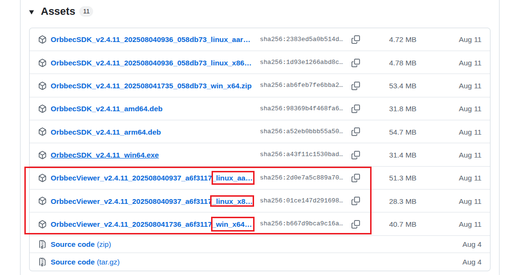
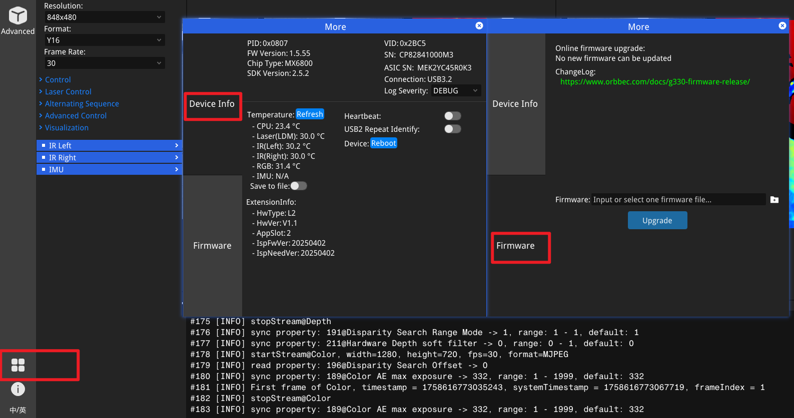

# OrbbecViewer QuickStarts

## Download

**Repository link：**[OrbbecViewer Download](https://github.com/orbbec/OrbbecSDK_v2/releases)

Select the appropriate version of OrbbecViewer according to your device type.

## Connect the device

When the Orbbec Viewer is open, the current device connection status will be prominently displayed in the top left corner of the application window. This area provides instant feedback about whether the camera is connected and functioning properly.

## Camera Control

You can quickly view the image using the buttons at the top of the window, and adjust image parameters in the camera panel on the left side of the window.

## Device information and firmware upgrade

Click the icon at the bottom left corner of the window to view the current camera information and upgrade the firmware.

Please refer to the list below for the latest camera firmware. [For more information, please click here.](https://www.orbbec.com/docs/g330-explore-camera-functions-in-orbbec-viewer/)

**Repository link：**[Firmware Download](https://github.com/orbbec/OrbbecFirmware?tab=readme-ov-file#firmware-download)

| **Products list** | **Download link**                                                                           | Latest version |
| ----------------------- | ------------------------------------------------------------------------------------------------- | -------------- |
| Femto Bolt              | [Femto Bolt Firmware](https://github.com/orbbec/OrbbecFirmware/releases/tag/Femto-Bolt-Firmware)     | v1.1.2         |
| Femto Mega              | [Femto Mega Firmware](https://github.com/orbbec/OrbbecFirmware/releases/tag/Femto-Mega-Firmware)     | v1.3.1         |
| Gemini 2                | [Gemini 2 Firmware](https://github.com/orbbec/OrbbecFirmware/releases/tag/Gemini2-Firmware)          | v1.4.98        |
| Gemini 2 L              | [Gemini 2L Firmware](https://github.com/orbbec/OrbbecFirmware/releases/tag/Gemini2L-Firmware)        | v1.5.02        |
| Femto Mega I            | [Femto Mega I Firmware](https://github.com/orbbec/OrbbecFirmware/releases/tag/Femto-Mega-I-Firmware) | v2.0.4         |
| Gemini 330 series       | [Gemini 330 series Firmware](https://www.orbbec.com/docs/g330-firmware-release/?_gl=1)               |                |
| Gemini 215              | [Gemini 215](https://github.com/orbbec/OrbbecFirmware/releases/tag/Gemini215-Firmware)               | v1.0.9         |
| Gemini 210              | [Gemini 210](https://github.com/orbbec/OrbbecFirmware/releases/tag/Gemini210-Firmware)               | v1.0.9         |
| Gemini 435Le            | [Gemini 435Le](https://github.com/orbbec/OrbbecFirmware/releases/tag/Gemin435Le-Firmware)            | v1.3.2         |
