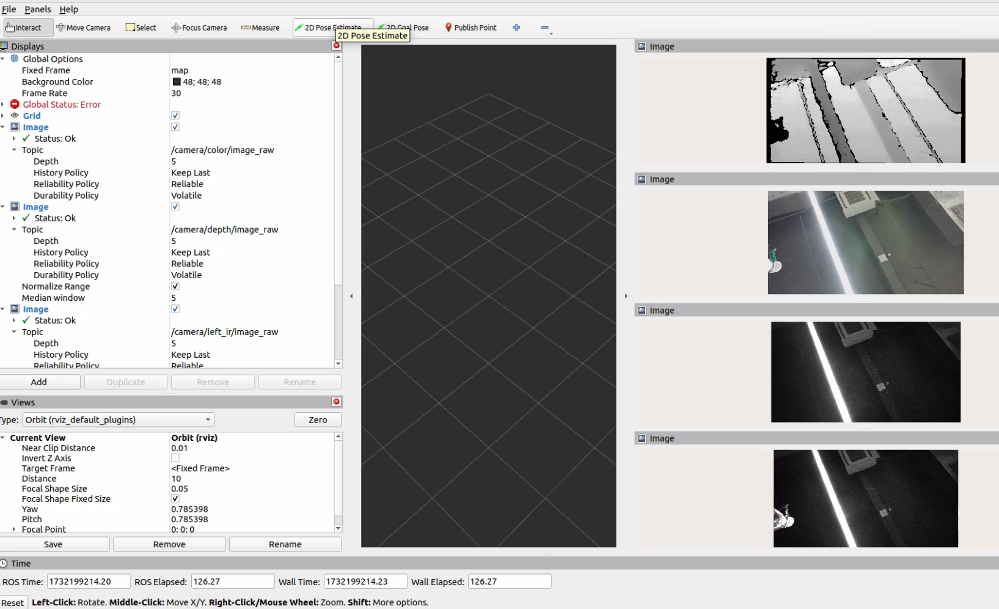
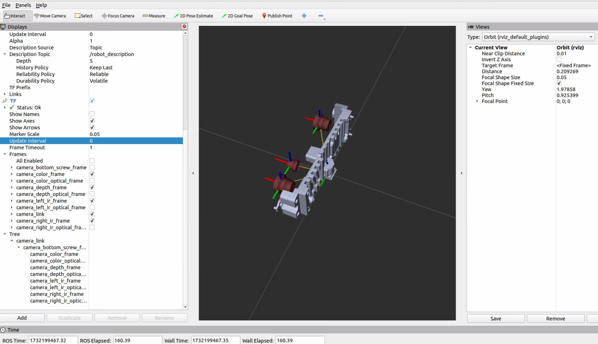
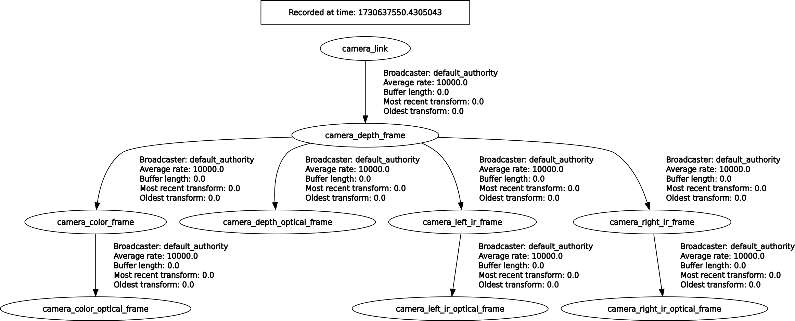

<!-- docs/source/3_start_single_camera/start_single_camera.md -->

# Single camera

This guide provides instructions on how to launch the camera node with a colored point cloud feature enabled using ROS 2.

- Table of contents
  - [Start single camera](#start-single-camera)
  - [Visualizing data in rviz2](#visualizing-data-in-rviz2)
  - [Display view topics service](#display-view-topics-service)
  - [Example visualizations](#example-visualizations)
  - [TF tree diagram](#tf-tree-diagram)

## Start single camera

For how to compile and build methods, please refer to Chapter `Installation/Build_the_package `documentation and follow the steps provided
[build_the_package](../2_installation/build_the_package.md)

- Command to start single camera node

On terminal 1: Launch camera node, example of gemini330 series :

```bash
cd ~/ros2_ws/
source /opt/ros/$ROS_DISTRO/setup.bash
source install/setup.bash
ros2 launch orbbec_camera orbbec_camera.launch.py config_file_path:=gemini330_series.yaml
```

## Visualizing data in rviz2

- view_display launch

`view_display.launch.py` supports loading different `.rviz` files through yaml configuration. For example, loading the default `.rviz` file to display four streams.  config in different `.model.yaml `files through yaml configuration.

On terminal 2:

```bash
cd ~/ros2_ws/
source /opt/ros/$ROS_DISTRO/setup.bash
source install/setup.bash
ros2 launch orbbec_description view_display.launch.py camera_model:=gemini335_336
```



- view_model launch

`view_model.launch.py` supports loading different `.model.yaml `files through yaml configuration. For example, loading the default model file to display gemini335_336 model .

On terminal 3:

```bash
cd ~/ros2_ws/
source /opt/ros/$ROS_DISTRO/setup.bash
source install/setup.bash
ros2 launch orbbec_description view_model.launch.py camera_model:=gemini335_336
```



- Or you can run rviz2 and configure it  by yourself

```bash
cd ~/ros2_ws/
source /opt/ros/$ROS_DISTRO/setup.bash
source install/setup.bash
rviz2
```

When runing rviz2, select the topic you wish to visualize from the list of published topics.
Add the selected topic to rviz2 to start viewing the data.

## Display view topic/service/param

Once the camera node is running, it will publish data on several ROS topics. Below is a list of the available topics:
By executing `ros2 topic list`, the following topics are displayed:

On terminal 4:

```bash
ros2 topic list
```

Other , to display services/ parameters , example as follows

```bash
ros2 service list
ros2 param list
```

Get device info:

```bash
ros2 service call /camera/get_device_info orbbec_camera_msgs/srv/GetDeviceInfo '{}'
```

Get SDK version:

```bash
ros2 service call /camera/get_sdk_version orbbec_camera_msgs/srv/GetString '{}'
```

Set auto exposure:

```bash
ros2 service call /camera/set_color_auto_exposure std_srvs/srv/SetBool '{data: false}'
```

Save point cloud:

```bash
ros2 service call /camera/save_point_cloud std_srvs/srv/Empty "{}"
```

&nbsp;

## Example visualizations

Here are examples of how the visualization might appear in rviz2:

- **PointCloud Visualization**


&nbsp;

- **Image Data Visualization**


&nbsp;

## TF tree diagram

To get the TF tree

```bash
ros2 run rqt_tf_tree rqt_tf_tree --force-discover
```

&nbsp;

The TF tree diagram for the OrbbecSDK_ROS2 is illustrated below:

