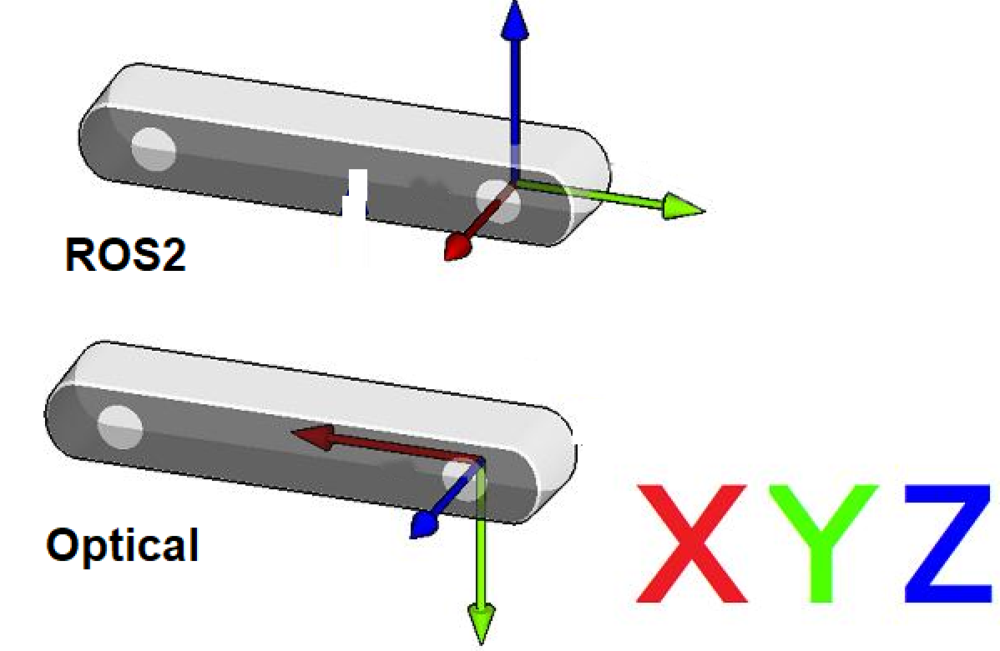

### ROS2(Robot) vs Optical(Camera) Coordination Systems

* Point Of View:
  * Imagine we are standing behind of the camera, and looking forward.
  * Always use this point of view when talking about coordinates, left vs right IRs, position of sensor, etc..

* ROS2 Coordinate System: (X: Forward, Y:Left, Z: Up)
* Camera Optical Coordinate System: (X: Right, Y: Down, Z: Forward)
* All data published in our wrapper topics is optical data taken directly from our camera sensors.
* static and dynamic TF topics publish optical CS and ROS CS to give the user the ability to move from one CS to other CS.

