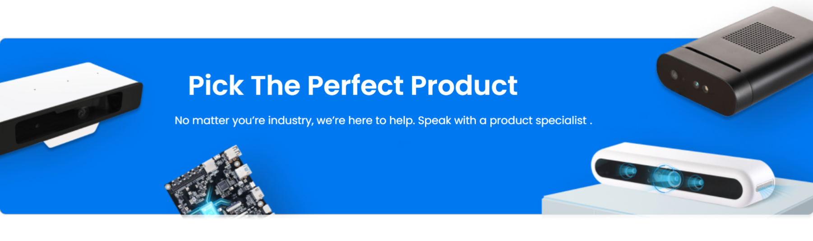

.. 这一页是模块目录树

.. .. image::  ../image/product_h9.png

======================================================

Advanced
======================================================

This section explores the advanced usage of Orbbec SDK ROS2, specifically tailored for product application scenarios. It offers comprehensive guidance on how to fully harness the SDK's capabilities, enabling you to unlock the potential of your robotics projects. Discover the optimal ways to enhance your projects using the cutting-edge features provided by Orbbec SDK ROS2 environments.

======================================================

.. toctree::
    :maxdepth: 2
    :caption: This Section Covers:

    multi_camera_sync.md
    component_node.md
    zero_copy.md
    gdb_debug.md
    backward_ros.md
    cyclonedds_tuning.md
    fastdds_tuning.md

======================================================

