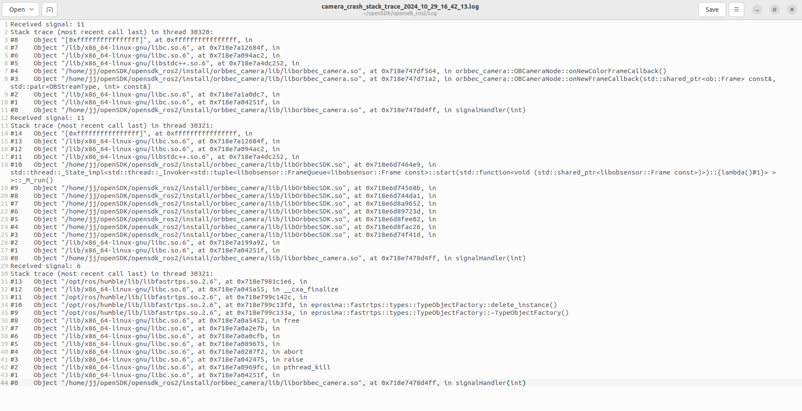

# Backward ros

To use the `backward_ros` package for debugging your ROS2 project named `OrbbecSDK_ROS2`, you can follow these steps:

## Add `backward_ros` as a dependency:

   In your `package.xml`, add `backward_ros` as a dependency:

xml

```
<depend>backward_ros</depend>
```

## Configure `CMakeLists.txt`:

   In your `CMakeLists.txt`, find the `backward_ros` package and link it to your executable:

cmake

```
find_package(backward_ros REQUIRED)
include_directories(${backward_INCLUDE_DIRS})
add_executable(your_node src/your_node.cpp)
target_link_libraries(your_node ${backward_LIBRARIES})
```

## Build your project with debug information:

   Use `colcon build` with the `RelWithDebInfo` or `Debug` option to ensure that your executable is built with debug information:

```
colcon build --cmake-args '-DCMAKE_BUILD_TYPE=RelWithDebInfo'
```

## Run your node:

   After building, you can run your node as you normally would with ROS 2. If your node crashes, `backward_ros` will automatically generate a stack trace with detailed information, including line numbers, to help you debug the issue.

## Example `backward_ros`

   When your program crashes, you can go to the Log folder under the workspace to find the stack trace of the crash.


