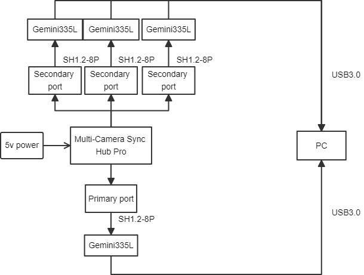
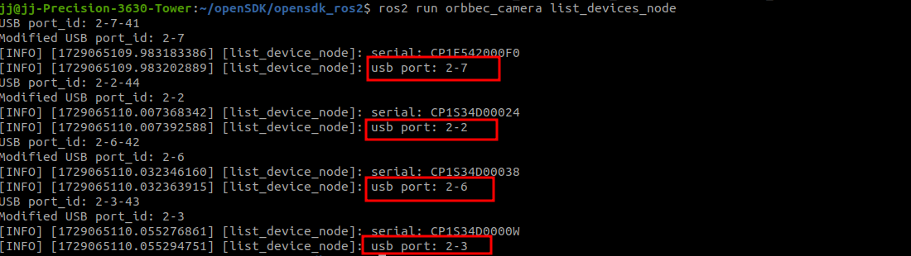
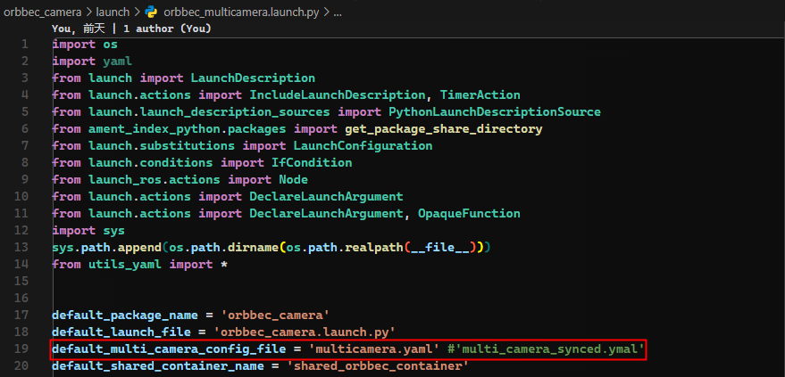
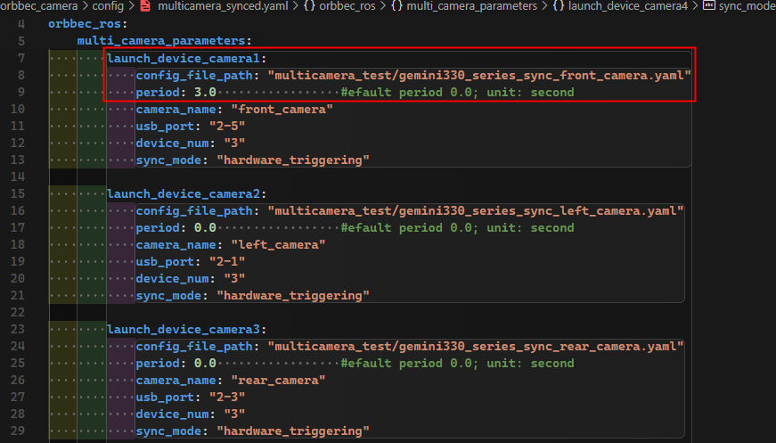
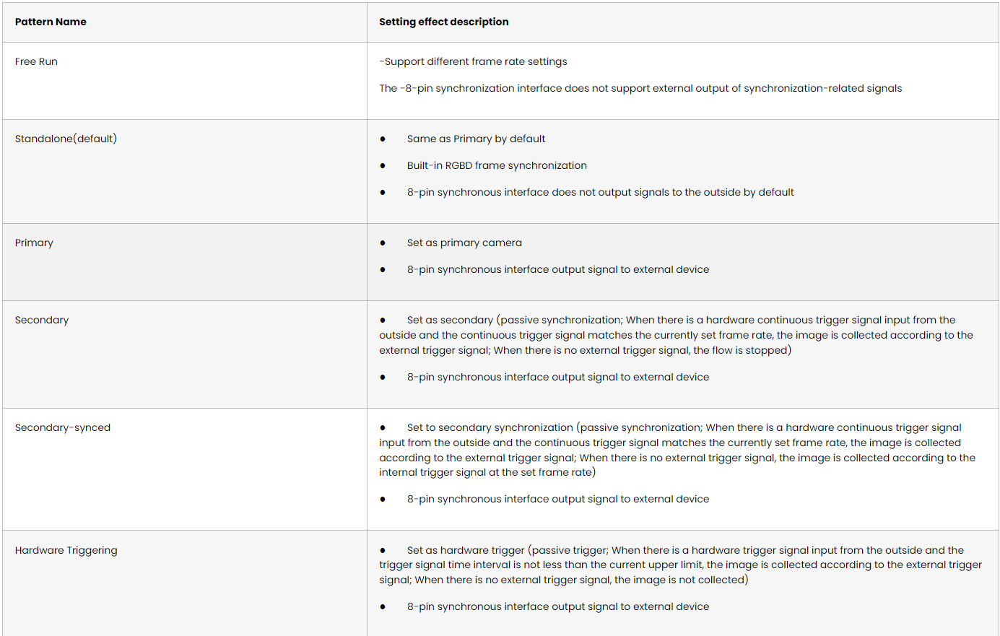
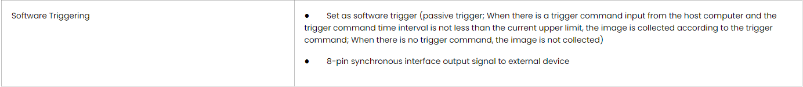

<!-- docs/source/6_advanced/multi_camera_sync.md -->

# Multiple cameras synchronization

- Table of contents

  - [Preparation](#preparation)
  - [Check the camera usb port](#check-the-camera-usb-port)
  - [Configure multi_camera_synced.launch.py](#configure-multi_camera_synced.launch.py)
  - [Run multi_camera_synced.launch.py](#run-multi_camera_synced.launch.py)
  - [Advanced Parameters](#advanced-parameters)
  - [Gmsl example](#gmsl-example)
  - [suggestions for multiple cameras synchronization](#suggestions for multiple cameras synchronization)

## Preparation

First, please read the user documentation:[https://www.orbbec.com/docs/set-up-cameras-for-external-synchronization_v1-2/](https://www.orbbec.com/docs/set-up-cameras-for-external-synchronization_v1-2/)

Secondly,make sure the cameras are properly connected to the multi-camera synchronizer



## Check the camera usb port

```bash
ros2 run orbbec_camera list_devices_node
```

Output:



## Configure multiple cameras synced

Open `orbbec_multicamera.launch.py`, the camera configuration is as shown below

You can replace `multicamera.yaml `with other yaml files, such as `multicamera_synced.yaml`



Open `multicamera_synced.yaml`，the camera configuration is as shown below



```
note: gemini330_series_sync_front_camera.yaml  is the camera configuration file.
```


**When configuring multiple cameras sync, you need to pay attention to the following parameters:**

1.**camera_name**

camera_name is set to front_camera, for example, the color image topic name is /front_camera/color/image_raw"

2.**usb_port**

The `usb_port` parameter specifies the USB port number to which the camera is connected. In your example, "2-7" indicates that the camera devices connected to USB ports 2 through 7 are started. You can use the command `ros2 run orbbec_camera list_devices_node` to view the device port numbers.

Please ensure that these port numbers match your actual hardware cameras. If you have more cameras or cameras connected to different ports, you need to configure the corresponding port number for each device.

3.**device_num**

The device_num parameter indicates the number of cameras to be started. Please ensure that this value matches the number of cameras you want to start and does not exceed the number of cameras actually connected or the system's processing capacity.

4.**sync_mode**

sync_mode is set to software_triggering, indicating that the 2-7 camera device is set to software trigger mode, and the selection of multiple cameras synchronization mode can refer to the following table.

Please refer to the[multi-camera synchronization mode definition description](https://www.orbbec.com/docs-general/set-up-cameras-for-external-synchronization_v1-2/#) for details.




`multicamera_synced.yaml`  describes the camera startup order, the host must be started last


## Run `multicamera_synced.launch.py`

```bash
ros2 launch orbbec_camera multicamera_synced.launch.py
```

## Advanced sync parameters

Some camera parameters are related to multi-camera sync

| Camera parameters       | action                                                        |
| ----------------------- | ------------------------------------------------------------- |
| trigger_out_enabled     | Trigger signal switch setting                                 |
| trigger2image_delay_us  | Configure the secondarydepth delay and secondarycolor delay  |
| trigger_out_delay_us    | Trigger signal delay                                          |
| frames_per_trigger      | Software trigger frequency(used with software_trigger_period) |
| software_trigger_period | Software trigger interval(used with frames_per_trigger)       |


## GMSL camera example

**Key Distinctions Between GMSL and USB Devices:**

**1.usb_port Configuration:**

• For USB cameras, the port is specified as:   usb_port: "2-3"

• For GMSL cameras, the port should be designated as:   usb_port: "gmsl2-3"

**2.Color Stream Format Compatibility:**

• It is important to note that GMSL devices do not support the MJPG color format. Consequently, the format must be switched to YUYV when utilizing GMSL equipment.


## suggestions for multiple cameras synchronization

When configuring multiple cameras, there are several additional points to consider:

1.Power Supply: Ensure that each camera receives sufficient power supply. Simultaneous operation of multiple high-power devices can put strain on the USB bus.

2.Bandwidth Limitations: Simultaneous data transfer from multiple cameras can strain the USB bus or network bandwidth. Consider using higher bandwidth connections (such as USB 3.0 or higher) or optimizing data transfer settings.

3.Synchronization Issues: If you require time synchronization between multiple cameras, ensure that your system supports and is properly configured for camera synchronization.

4.Software Configuration: In ROS, you may need to configure separate nodes and topics for each camera to ensure they do not conflict. Using namespaces and the parameter server can help manage these configurations.

Finally, do not forget to conduct thorough testing before deployment to ensure that all cameras function correctly and that system performance meets expectations.
