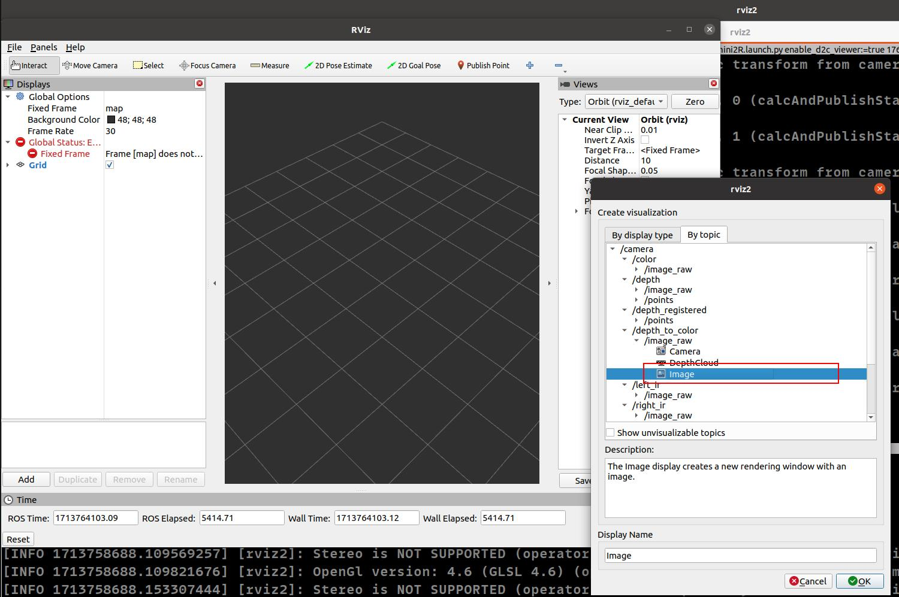
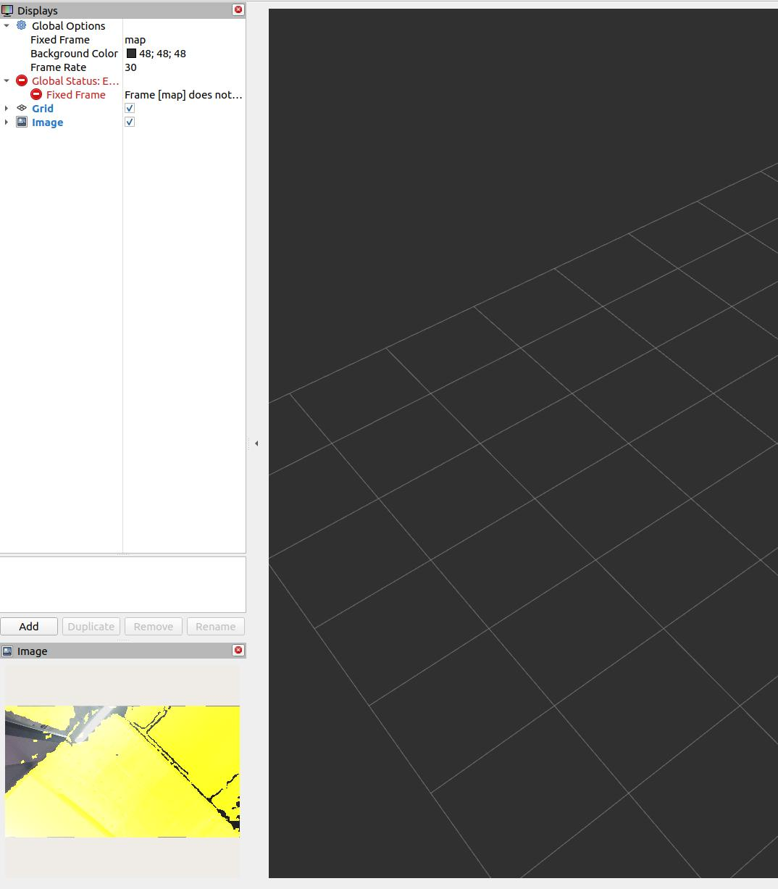

## Aligning Depth to Color in ROS 2

This section explains how to align depth images with color images to create an overlay image using ROS 2. This is particularly useful for applications requiring synchronized visual information from different sensor modalities.

### Commands to Align and View Depth and Color Images

1. **Basic Depth to Color Alignment:**

   To simply align the depth image to the color image, use the following command:

   ```bash
   ros2 launch orbbec_camera gemini_330_series.launch.py depth_registration:=true
   ```

   This command activates the depth registration feature without opening a viewer.
2. **Viewing Depth to Color Overlay:**

   If you wish to view the depth to color overlay, you need to enable the viewer by using the command below:

   ```bash
   ros2 launch orbbec_camera gemini_330_series.launch.py depth_registration:=true enable_d2c_viewer:=true
   ```

   This launches the camera node with depth to color registration and opens a viewer to display the overlay image.

### Selecting Topics in RViz2

To visualize the aligned images in RViz2:

1. Launch RViz2 after running one of the above commands.
2. Select the topic for the depth to color overlay image. An example topic selection is shown here:

   

### Example of Depth to Color Overlay

After selecting the appropriate topic in RViz2, you will be able to see the depth to color overlay image. Here's what it might look like:


