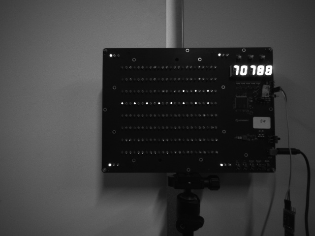
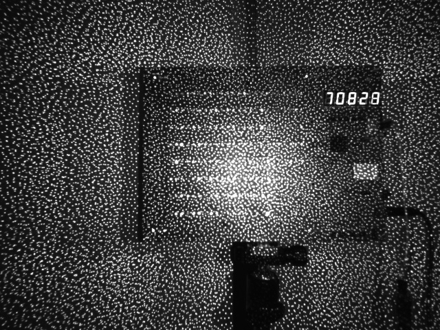

# Using interleave_ae with Gemini330 series cameras

> This section describes how to use interleave_ae in Gemini 330 series cameras (minimum camera firmware version [1.4.00](https://www.orbbec.com/docs/g330-firmware-release/))

## Parameter Introduction

The interleave_ae related parameters are set in [gemini_330_series.launch.py](../../launch/gemini_330_series.launch.py)

* `interleave_ae_mode` : Set laser or hdr interleave.

* `interleave_frame_enable` : enable interleave frame mode.

* `interleave_skip_enable` : enable skip frame mode.

* `interleave_skip_index` : Set 0 for skip pattern ir, set 1 for skip flood ir.

### interleave hdr

When the `interleave_ae_mode` parameter is set to `hdr` and `interleave_frame_enable `is set to `true`, interleave hdr will be enabled

* `hdr_index1_laser_control` : Frame 1 laser switch settings.

* `hdr_index1_depth_exposure` : Frame 1 depth exposure value setting, not in AE mode.

* `hdr_index1_depth_gain` : Frame 1 depth gain value setting, not in AE mode.

* `hdr_index1_ir_brightness` : Frame 1 ir gain value setting.

* `hdr_index1_ir_ae_max_exposure` : Frame 1 ir maximum exposure value setting in AE (auto exposure).

* `hdr_index0_laser_control`: Frame 0 laser switch settings.

* `hdr_index0_depth_exposure`: Frame 0 depth exposure value setting, not in AE mode.

* `hdr_index0_depth_gain` : Frame 0 depth gain value setting, not in AE mode.

* `hdr_index0_ir_brightness` : Frame 0 ir gain value setting.

* `hdr_index0_ir_ae_max_exposure` : Frame 0 ir maximum exposure value setting in AE (auto exposure).

### interleave laser

When the `interleave_ae_mode` parameter is set to `laser` and `interleave_frame_enable `is set to `true`, interleave laser will be enabled

* `laser_index1_laser_control` : Frame 1 laser switch settings.

* `laser_index1_depth_exposure` : Frame 1 depth exposure value setting, not in AE mode.

* `laser_index1_depth_gain` : Frame 1 depth gain value setting, not in AE mode.

* `laser_index1_ir_brightness` : Frame 1 ir gain value setting.

* `laser_index1_ir_ae_max_exposure` : Frame 1 ir maximum exposure value setting in AE (auto exposure).

* `laser_index0_laser_control` : Frame 0 laser switch settings.

* `laser_index0_depth_exposure` : Frame 0 depth exposure value setting, not in AE mode.

* `laser_index0_depth_gain` : Frame 0 depth gain value setting, not in AE mode.

* `laser_index0_ir_brightness` : Frame 0 ir gain value setting.

* `laser_index0_ir_ae_max_exposure` : Frame 0 ir maximum exposure value setting in AE (auto exposure).

## Run the launch

Setting the interleave_ae parameter,`colcon build` again and run launch

```bash
ros2 launch orbbec_camera gemini_330_series.launch.py
```

#### Example Visualization





## Multi_camera_synced + Interleave_ae

Please refer to [multi_camera_synced](../multi_camera_synced/README.MD) and [Parameter Introduction](#parameter-introduction)
