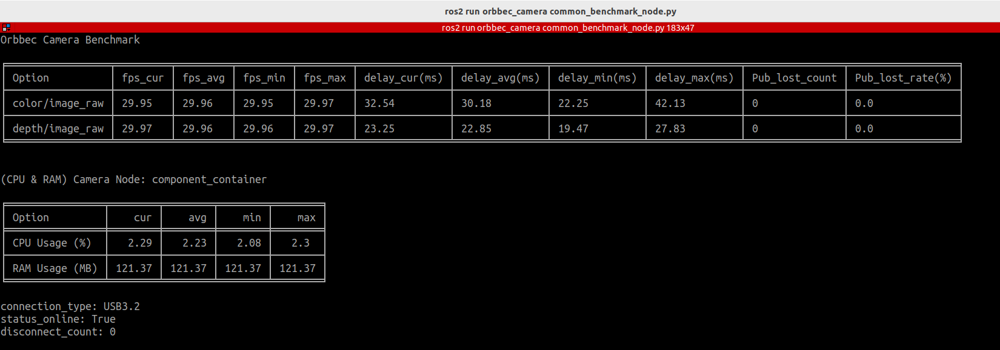

# Introduction

This section introduces the benchmark tool, explaining its purpose, features, and what it can help you measure.

## common benchmark node

`common_benchmark_node.py` is a tool for monitoring the performance of Orbbec cameras running in a ROS environment. It collects and records key camera metrics such as frame rate, latency, system resource usage, and packet loss rate in real time, helping users evaluate the stability and performance of camera nodes (updated once per second).

**Features**

- Measure published image frame rate and latency (current, min, max, average)

- Monitor the camera node's CPU/ARM usage (current, min, max, average)

- Track frame drop rate (publisher) and packet loss rate (subscriber)

- Print real-time statistics (1 Hz) to the terminal and save results to a CSV file

- Support configurable runtime duration and CSV output path

**Example**

In ROS1, both frame drop rate and packet loss rate can be measured, while in ROS2, the header lacks the `seq` field, so only the publisher-side frame drop rate is calculated.

## service benchmark node

The `service_benchmark_node` tool is used to monitor the performance of service calls. It can measure the success rate of service calls and the time required to execute service.

**Features**

- Benchmark a single service call, measuring latency and success rate

- Benchmark multiple services as defined in a YAML configuration file

- Optionally save benchmark results to a CSV file

**Example**

When you need to collect data for multiple services, it is recommended to use a CSV file for analysis.