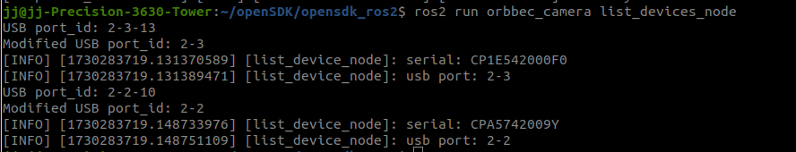
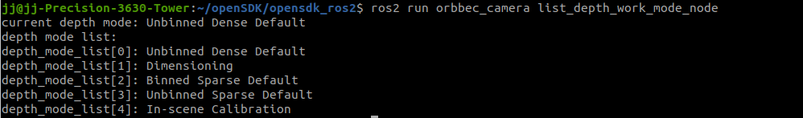
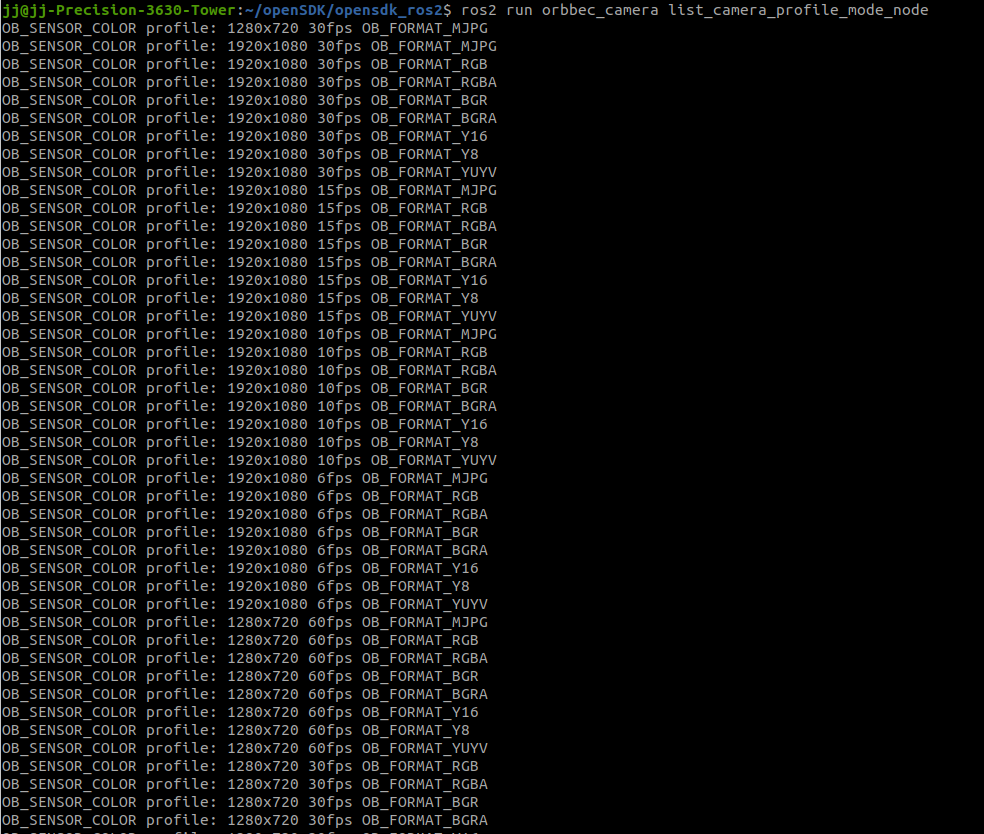

# Some practical tools

| Tool Name                     | effect                                                                                                         |
| ----------------------------- | -------------------------------------------------------------------------------------------------------------- |
| list_devices_node             | check the camera USB port number                                                                               |
| list_depth_work_mode_node     | view depth work modes                                                                                          |
| list_camera_profile_mode_node | check which profiles the camera supports                                                                       |
| topic_statistics_node         | topic statistics                                                                                               |
| multi_save_rgbir_node         | Multi camera sync save image, used to test synchronization quality                                             |
| metadata_save_files_node      | Save the depth, left and right ir images and metadata data                                                     |
| metadata_export_files_node    | Compared with metadata_save_files_node, it has one more color collection but reduces some metadata data saving |

## list_devices_node

If you have connected multiple cameras, but you want to start a specific camera, you can run the list_devices_node tool to view the USB port of each camera.

```bash
ros2 run orbbec_camera list_devices_node
```



## list_depth_work_mode_node

OrbbecSDK_ROS2 supports the depth work mode switch. The depth work mode switch is supported by Gemini 2, Gemini 2 L, and Femto and Femto Bolt cameras.

View depth work modes:

```bash
ros2 run orbbec_camera list_depth_work_mode_node
```



## list_camera_profile_mode_node

Check which profiles the camera supports:

```bash
ros2 run orbbec_camera list_camera_profile_mode_node
```



The above image only shows part of the output

## multi_save_rgbir_node

The purpose of multi_save_rgbir_node is to test the synchronization effect of using multiple Orbbec cameras in OrbbecSDK ROS2

This tool will save the color and left IR images of each camera and the timestamp information

The configuration parameter file of this tool node is multi_save_rgbir_params.json

```json
{
    "save_rgbir_params": {
        "time_domain": "device",
        "usb_ports": [
            "2-3",
            "2-1"
        ],
        "camera_name": [
            "G330_0",
            "G330_1"
        ]
    }
}
```

* time_domain: timestamp type
* usb_ports parameter order: "host", "slave 1", "slave 2", "slave 3", fill in as many usb_ports as there are cameras
* camera_name: the name set for the camera, for example: G330_0

## metadata_save_files_node

The metadata_save_files_node tool will save the depth, left and right IR, images and metadata data

The configuration parameter file of this tool node is metadata_save_params.json

```json
{
    "metadata_save_params": {
        "left_ir_image_topic": "/camera/left_ir/image_raw",
        "right_ir_image_topic": "/camera/right_ir/image_raw",
        "depth_image_topic": "/camera/depth/image_raw",
        "left_ir_metadata_topic": "/camera/left_ir/metadata",
        "right_ir_metadata_topic": "/camera/right_ir/metadata",
        "depth_metadata_topic": "/camera/depth/metadata"
    }
}
```

```bash
ros2 run orbbec_camera metadata_save_files_node
```

## metadata_export_files_node

The metadata_save_files_node tool will save depth, color, left and right IR images and some metadata data

The configuration parameter file of this tool node is metadata_save_params.json

```json
{
    "metadata_export_params": {
        "sn": "CP1L44P00085",
        "left_ir_image_topic": "/camera/left_ir/image_raw",
        "right_ir_image_topic": "/camera/right_ir/image_raw",
        "depth_image_topic": "/camera/depth/image_raw",
        "color_image_topic": "/camera/color/image_raw",
        "left_ir_metadata_topic": "/camera/left_ir/metadata",
        "right_ir_metadata_topic": "/camera/right_ir/metadata",
        "depth_metadata_topic": "/camera/depth/metadata",
        "color_metadata_topic": "/camera/color/metadata"
    }
}
```

```bash
ros2 run orbbec_camera metadata_export_files_node
```
