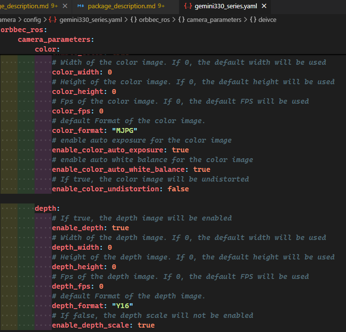

# FAQ

## Unexpected crash

If the camera node crashes unexpectedly, it will generate a crash log in the current running directory: `Log/camera_crash_stack_trace_xx.log`.
Please send this log to the support team or submit it to a GitHub issue for further assistance.

**Regarding logging, please refer to the following log recommendations:**

In ROS, the location of the log directory is typically associated with the ROS workspace, but the specific log path may vary depending on the installation method and operating system.

Here are some common locations for ROS log directories:

1. **Default Global ROS Log Directory** : Global logs are typically recorded in the `~/.ros/log` directory. Here, `~` represents the user's home directory.
2. **Workspace-Specific Log Directories** : In some cases, ROS nodes may log to specific directories within their workspace. This can often be achieved by setting the `ROS_LOG_DIR` environment variable.

For the underlying Orbbec SDK, the log level can be configured via the `log_level` field in the `common.yaml` file.

## How to Quickly Modify the Default Resolution

How to Quickly Modify the Default Resolution, Video Format, and Frame Rate Parameters of a Product?

1.Locate the corresponding product yaml configuration file, such as gemini330_series.yaml, in the orbbec_camera/config directory.
2.Open the corresponding product yaml configuration file, such as gemini330_series.yaml, and modify the resolution, format, and frame rate settings for the video stream.

For example:



3.Compile and Run

```
colcon build --event-handlers  console_direct+  --cmake-args  -DCMAKE_BUILD_TYPE=Release
source install/setup.bash
ros2 launch orbbec_camera orbbec_camera.launch.py config_file_path:=gemini330_series.yaml
```

## No data stream from multiple cameras

**Insufficient Power Supply**:

- Ensure that each camera is connected to a separate hub.
- Use a powered hub to provide sufficient power to each camera.

**High Resolution**:

- Try lowering the resolution to resolve data stream issues.

**Increase usbfs_memory_mb Value**:

- Increase the `usbfs_memory_mb` value to 128MB (this is a reference value and can be adjusted based on your system’s needs)
  by running the following command:

```bash
echo 128 | sudo tee /sys/module/usbcore/parameters/usbfs_memory_mb
```

- To make this change permanent, check [this link](https://github.com/OpenKinect/libfreenect2/issues/807).

## Additional troubleshooting

- If you encounter other issues, set the `log_level` parameter to `debug`. This will generate an SDK log file in the running directory: `Log/OrbbecSDK.log.txt`.
  Please provide this file to the support team for further assistance.
- If firmware logs are required, set `enable_heartbeat` to `true` to activate this feature.

## Why are there so many yaml files?

- Different yaml files have varying default resolutions and image formats.
- To simplify usage, each camera has its own yaml file.
