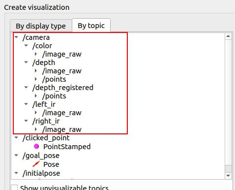
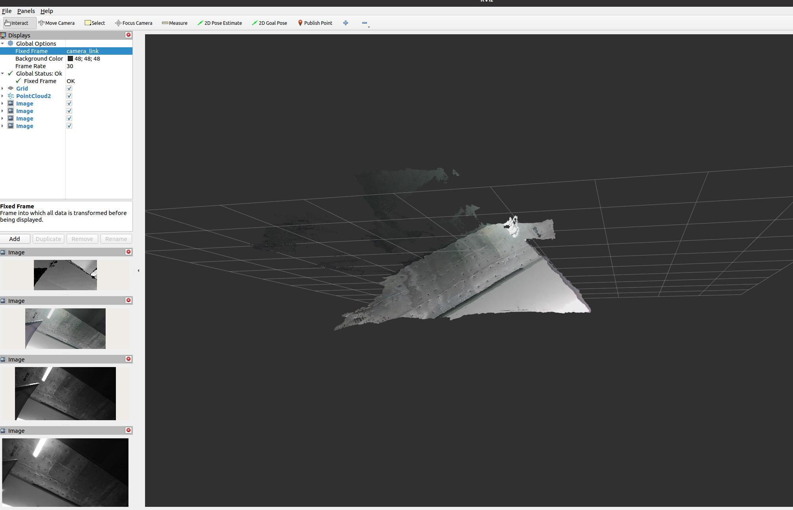

## 在ROS 2中启动相机节点

本指南提供了使用ROS 2启动启用彩色点云功能的相机节点的指令。

### 启动节点的命令

要启动相机节点，请在终端执行以下命令：

```bash
ros2 launch orbbec_camera gemini_330_series.launch.py enable_colored_point_cloud:=true
```

此命令将启动相机节点并启用彩色点云。

### 发布的主题

一旦相机节点运行，它将在多个ROS主题上发布数据。以下是可用主题的列表：

- **IMU数据和IMU信息：**
  - `camera/accel/imu_info`
  - `camera/gyro/imu_info`
  - `camera/gyro_accel/sample`

- **彩色相机主题：**
  - `/camera/color/camera_info`
  - `/camera/color/image_raw`
  - `/camera/color/image_raw/compressed`
  - `/camera/color/image_raw/compressedDepth`
  - `/camera/color/image_raw/theora`
  - `/camera/color/metadata`

- **深度相机主题：**
  - `/camera/depth/camera_info`
  - `/camera/depth/image_raw`
  - `/camera/depth/image_raw/compressed`
  - `/camera/depth/image_raw/compressedDepth`
  - `/camera/depth/image_raw/theora`
  - `/camera/depth/metadata`
  - `/camera/depth/points`
  - `/camera/depth_filter_status`
  - `/camera/depth_registered/points`
  - `/camera/depth_to_color`
  - `/camera/depth_to_left_ir`
  - `/camera/depth_to_right_ir`

- **红外相机主题：**
  - `/camera/left_ir/camera_info`
  - `/camera/left_ir/image_raw`
  - `/camera/left_ir/image_raw/compressed`
  - `/camera/left_ir/image_raw/compressedDepth`
  - `/camera/left_ir/image_raw/theora`
  - `/camera/left_ir/metadata`
  - `/camera/right_ir/camera_info`
  - `/camera/right_ir/image_raw`
  - `/camera/right_ir/image_raw/compressed`
  - `/camera/right_ir/image_raw/compressedDepth`
  - `/camera/right_ir/image_raw/theora`
  - `/camera/right_ir/metadata`

- **杂项主题：**
  - `/diagnostics`
  - `/parameter_events`
  - `/rosout`
  - `/rosout_agg`

### 在RViz2中可视化数据

要查看点云或图像数据，请使用RViz2：

1. 启动RViz2。
2. 从发布的主题列表中选择您希望可视化的主题。
3. 将选定的主题添加到RViz2中开始查看数据。

### 示例可视化

以下是在RViz2中可视化可能出现的示例：

- **点云可视化**
  
  
- **图像数据可视化**
  