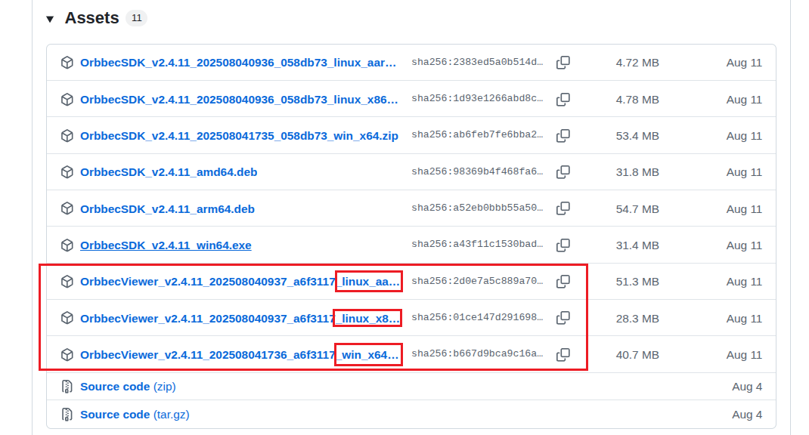
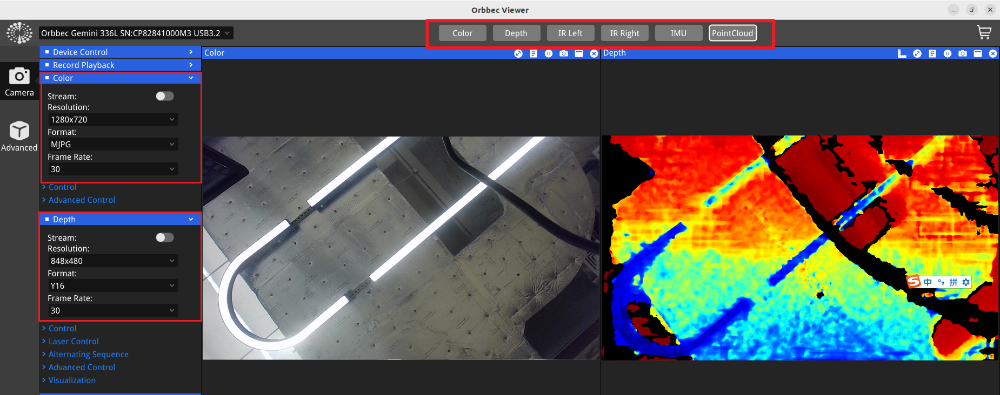

# OrbbecViewer 快速入门

> **注意：** 此 ROS 包的参数和功能与 **Orbbec Viewer** 保持一致；有关参数使用或设备型号支持的任何问题，请参考 Orbbec Viewer。

## 下载

**仓库链接：**[OrbbecViewer 下载](https://github.com/orbbec/OrbbecSDK_v2/releases)

根据您的设备类型选择合适版本的 OrbbecViewer。

## 连接设备

当 Orbbec Viewer 打开时，当前设备连接状态将显著地显示在应用程序窗口的左上角。此区域提供关于相机是否已连接并正常工作的即时反馈。

## 相机控制

您可以使用窗口顶部的按钮快速查看图像，并在窗口左侧的相机面板中调整图像参数。

## 设备信息和固件升级

点击窗口左下角的图标以查看当前相机信息并升级固件。

请参考下面的列表获取最新的相机固件。[更多信息请点击这里。](https://www.orbbec.com/docs/g330-explore-camera-functions-in-orbbec-viewer/)

**仓库链接：**[固件下载](https://github.com/orbbec/OrbbecFirmware?tab=readme-ov-file#firmware-download)

| **产品列表**       | **下载链接**                                                                                       | 最新版本   |
| ------------------ | -------------------------------------------------------------------------------------------------- | ---------- |
| Femto Bolt         | [Femto Bolt 固件](https://github.com/orbbec/OrbbecFirmware/releases/tag/Femto-Bolt-Firmware)      | v1.1.2     |
| Femto Mega         | [Femto Mega 固件](https://github.com/orbbec/OrbbecFirmware/releases/tag/Femto-Mega-Firmware)      | v1.3.1     |
| Gemini 2           | [Gemini 2 固件](https://github.com/orbbec/OrbbecFirmware/releases/tag/Gemini2-Firmware)           | v1.4.98    |
| Gemini 2 L         | [Gemini 2L 固件](https://github.com/orbbec/OrbbecFirmware/releases/tag/Gemini2L-Firmware)         | v1.5.02    |
| Femto Mega I       | [Femto Mega I 固件](https://github.com/orbbec/OrbbecFirmware/releases/tag/Femto-Mega-I-Firmware)  | v2.0.4     |
| Gemini 330 系列    | [Gemini 330 系列固件](https://www.orbbec.com/docs/g330-firmware-release/?_gl=1)                   |            |
| Gemini 215         | [Gemini 215](https://github.com/orbbec/OrbbecFirmware/releases/tag/Gemini215-Firmware)            | v1.0.9     |
| Gemini 210         | [Gemini 210](https://github.com/orbbec/OrbbecFirmware/releases/tag/Gemini210-Firmware)            | v1.0.9     |
| Gemini 435Le       | [Gemini 435Le](https://github.com/orbbec/OrbbecFirmware/releases/tag/Gemin435Le-Firmware)         | v1.3.2     |

