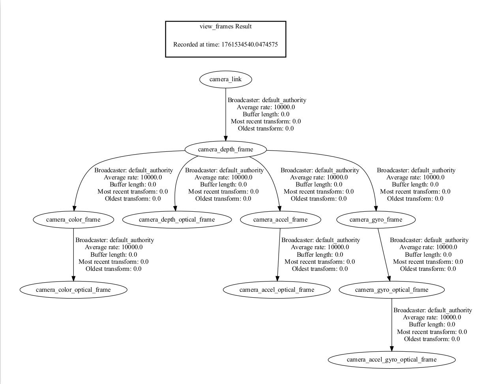
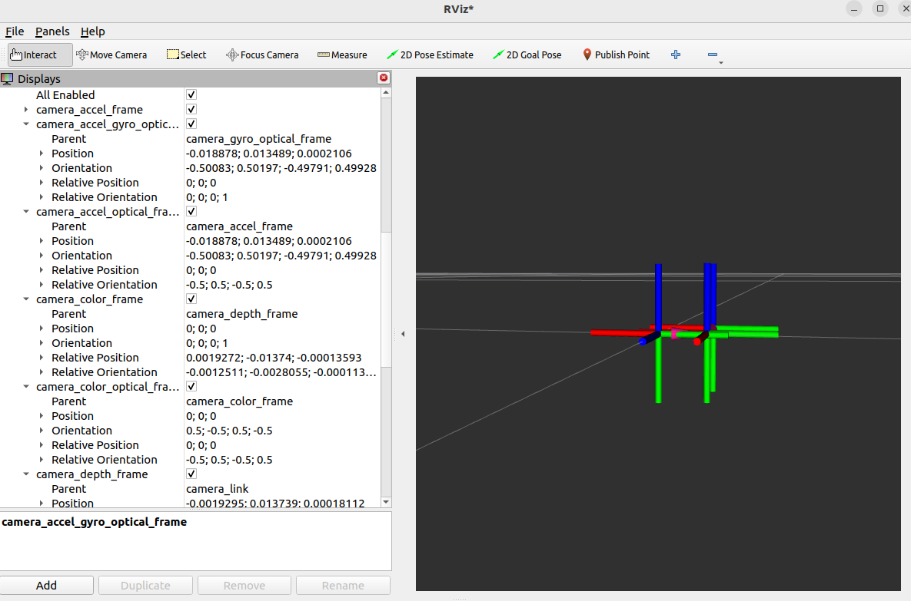

## 坐标系和 TF 变换

### 相机传感器结构


### ROS2机器人坐标系 vs 相机光学坐标系

* 视角：
  * 想象我们站在相机后面，向前看。
  * 在讨论坐标、左右红外、传感器位置等时，始终使用此视角。


* ROS2坐标系：（X: 向前，Y: 向左，Z: 向上）
* 相机光学坐标系：（X: 向右，Y: 向下，Z: 向前）
* 我们封装器话题中发布的所有数据都是直接从相机传感器获取的光学数据。
* 静态和动态TF话题发布光学坐标系和ROS坐标系，使用户能够在两个坐标系之间转换。

### ROS2 TF工具的使用

#### 查看TF树结构

可以使用以下ROS2命令来打印和可视化相机包发布的TF树：

**打印所有TF关系：**

```bash
ros2 run tf2_tools view_frames
```

这个命令会生成一个 `frames.pdf`文件，展示所有frame之间的层级关系。



**查看所有正在发布的TF信息：**

```bash
ros2 topic echo /tf_static
```

**查看指定两个frame之间的TF变换关系：**

使用以下命令可以查看两个特定frame之间的变换关系：

```bash
ros2 run tf2_ros tf2_echo [source_frame] [target_frame]
```

例如，查看从 `camera_link` 到 `camera_depth_optical_frame` 的变换：

```bash
ros2 run tf2_ros tf2_echo camera_link camera_depth_optical_frame
```

此命令会持续输出两个frame之间的实时变换信息，包括：

- 平移 (Translation)：x、y、z 坐标（单位：米）
- 旋转 (Rotation)：四元数 (x, y, z, w)
- 欧拉角 (RPY)：以欧拉角形式表示的旋转
- 齐次变换矩阵 (Transform Matrix)：包含旋转和平移信息的 4×4 矩阵

示例输出：

```
At time 0.0
- Translation: [0.000, 0.000, 0.000]
- Rotation: in Quaternion [-0.500, 0.500, -0.500, 0.500]
- Rotation: in RPY (radian) [-1.571, -0.000, -1.571]
- Rotation: in RPY (degree) [-90.000, -0.000, -90.000]
- Matrix:
  0.000  0.000  1.000  0.000
 -1.000  0.000  0.000  0.000
  0.000 -1.000  0.000  0.000
  0.000  0.000  0.000  1.000
```

#### 使用rviz2可视化TF树

在rviz2中可以实时可视化TF树结构和坐标系的相对位置：

```bash
rviz2
```

在rviz2中：

- 添加 `TF`显示插件
- 配置固定框架（Fixed Frame）为 `camera_link`或 `camera_depth_optical_frame`
- 选择显示的TF框架树



### 相机TF计算和发布机制

#### 核心函数：[OBCameraNode::calcAndPublishStaticTransform()](https://github.com/orbbec/OrbbecSDK_ROS2/blob/166c35b4ea211c60265ca9b38b1b15519d1ea3dd/orbbec_camera/src/ob_camera_node.cpp#L3475)

相机节点通过此函数计算和发布所有传感器之间的静态转换关系。

```cpp
void OBCameraNode::calcAndPublishStaticTransform() {
  tf2::Quaternion quaternion_optical, zero_rot;
  zero_rot.setRPY(0.0, 0.0, 0.0);
  quaternion_optical.setRPY(-M_PI / 2, 0.0, -M_PI / 2);
  tf2::Vector3 zero_trans(0, 0, 0);
  auto base_stream_profile = stream_profile_[base_stream_];
  auto device_info = device_->getDeviceInfo();
  CHECK_NOTNULL(device_info);
  auto pid = device_info->getPid();
  if (!base_stream_profile) {
    RCLCPP_ERROR_STREAM(logger_, "Failed to get base stream profile");
    return;
  }
  CHECK_NOTNULL(base_stream_profile.get());
  for (const auto &item : stream_profile_) {
    auto stream_index = item.first;

    auto stream_profile = item.second;
    if (!stream_profile) {
      continue;
    }
    OBExtrinsic ex;
    try {
      ex = stream_profile->getExtrinsicTo(base_stream_profile);
    } catch (const ob::Error &e) {
      RCLCPP_ERROR_STREAM(logger_, "Failed to get " << stream_name_[stream_index]
                                                    << " extrinsic: " << e.getMessage());
      ex = OBExtrinsic({{1, 0, 0, 0, 1, 0, 0, 0, 1}, {0, 0, 0}});
    }

    auto Q = rotationMatrixToQuaternion(ex.rot);
    Q = quaternion_optical * Q * quaternion_optical.inverse();
    tf2::Vector3 trans(ex.trans[0], ex.trans[1], ex.trans[2]);
    auto timestamp = node_->now();
    if (stream_index.first != base_stream_.first) {
      if (stream_index.first == OB_STREAM_IR_RIGHT && base_stream_.first == OB_STREAM_DEPTH) {
        trans[0] = std::abs(trans[0]);  // because left and right ir calibration is error
      }
      publishStaticTF(timestamp, trans, Q, frame_id_[base_stream_], frame_id_[stream_index]);
    }
    publishStaticTF(timestamp, zero_trans, quaternion_optical, frame_id_[stream_index],
                    optical_frame_id_[stream_index]);
    RCLCPP_INFO_STREAM(logger_, "Publishing static transform from " << stream_name_[stream_index]
                                                                    << " to "
                                                                    << stream_name_[base_stream_]);
    RCLCPP_INFO_STREAM(logger_, "Translation " << trans[0] << ", " << trans[1] << ", " << trans[2]);
    RCLCPP_INFO_STREAM(logger_, "Rotation " << Q.getX() << ", " << Q.getY() << ", " << Q.getZ()
                                            << ", " << Q.getW());
  }

  if ((pid == FEMTO_BOLT_PID || pid == FEMTO_MEGA_PID) && enable_stream_[DEPTH] &&
      enable_stream_[COLOR] && enable_publish_extrinsic_) {
    // calc depth to color

    CHECK_NOTNULL(stream_profile_[COLOR]);
    auto depth_to_color_extrinsics = base_stream_profile->getExtrinsicTo(stream_profile_[COLOR]);
    auto Q = rotationMatrixToQuaternion(depth_to_color_extrinsics.rot);
    Q = quaternion_optical * Q * quaternion_optical.inverse();
    publishStaticTF(node_->now(), zero_trans, Q, camera_link_frame_id_, frame_id_[base_stream_]);
  } else {
    publishStaticTF(node_->now(), zero_trans, zero_rot, camera_link_frame_id_,
                    frame_id_[base_stream_]);
  }

  if (enable_stream_[DEPTH] && enable_stream_[COLOR] && enable_publish_extrinsic_) {
    static const char *frame_id = "depth_to_color_extrinsics";
    OBExtrinsic ex;
    try {
      ex = base_stream_profile->getExtrinsicTo(stream_profile_[COLOR]);
    } catch (const ob::Error &e) {
      RCLCPP_ERROR_STREAM(logger_,
                          "Failed to get " << frame_id << " extrinsic: " << e.getMessage());
      ex = OBExtrinsic({{1, 0, 0, 0, 1, 0, 0, 0, 1}, {0, 0, 0}});
    }
    depth_to_other_extrinsics_[COLOR] = ex;
    auto ex_msg = obExtrinsicsToMsg(ex, frame_id);
    CHECK_NOTNULL(depth_to_other_extrinsics_publishers_[COLOR]);
    depth_to_other_extrinsics_publishers_[COLOR]->publish(ex_msg);
  }

  if (enable_stream_[DEPTH] && enable_stream_[INFRA0] && enable_publish_extrinsic_) {
    static const char *frame_id = "depth_to_ir_extrinsics";
    OBExtrinsic ex;
    try {
      ex = base_stream_profile->getExtrinsicTo(stream_profile_[INFRA0]);
    } catch (const ob::Error &e) {
      RCLCPP_ERROR_STREAM(logger_,
                          "Failed to get " << frame_id << " extrinsic: " << e.getMessage());
      ex = OBExtrinsic({{1, 0, 0, 0, 1, 0, 0, 0, 1}, {0, 0, 0}});
    }
    depth_to_other_extrinsics_[INFRA0] = ex;
    auto ex_msg = obExtrinsicsToMsg(ex, frame_id);
    CHECK_NOTNULL(depth_to_other_extrinsics_publishers_[INFRA0]);
    depth_to_other_extrinsics_publishers_[INFRA0]->publish(ex_msg);
  }
  if (enable_stream_[DEPTH] && enable_stream_[INFRA1] && enable_publish_extrinsic_) {
    static const char *frame_id = "depth_to_left_ir_extrinsics";
    OBExtrinsic ex;
    try {
      ex = base_stream_profile->getExtrinsicTo(stream_profile_[INFRA1]);
    } catch (const ob::Error &e) {
      RCLCPP_ERROR_STREAM(logger_,
                          "Failed to get " << frame_id << " extrinsic: " << e.getMessage());
      ex = OBExtrinsic({{1, 0, 0, 0, 1, 0, 0, 0, 1}, {0, 0, 0}});
    }
    depth_to_other_extrinsics_[INFRA1] = ex;
    auto ex_msg = obExtrinsicsToMsg(ex, frame_id);
    CHECK_NOTNULL(depth_to_other_extrinsics_publishers_[INFRA1]);
    depth_to_other_extrinsics_publishers_[INFRA1]->publish(ex_msg);
  }
  if (enable_stream_[DEPTH] && enable_stream_[INFRA2] && enable_publish_extrinsic_) {
    static const char *frame_id = "depth_to_right_ir_extrinsics";
    OBExtrinsic ex;
    try {
      ex = base_stream_profile->getExtrinsicTo(stream_profile_[INFRA2]);
    } catch (const ob::Error &e) {
      RCLCPP_ERROR_STREAM(logger_,
                          "Failed to get " << frame_id << " extrinsic: " << e.getMessage());
      ex = OBExtrinsic({{1, 0, 0, 0, 1, 0, 0, 0, 1}, {0, 0, 0}});
    }
    ex.trans[0] = -std::abs(ex.trans[0]);
    depth_to_other_extrinsics_[INFRA2] = ex;
    auto ex_msg = obExtrinsicsToMsg(ex, frame_id);
    CHECK_NOTNULL(depth_to_other_extrinsics_publishers_[INFRA2]);
    depth_to_other_extrinsics_publishers_[INFRA2]->publish(ex_msg);
  }
  if (enable_stream_[DEPTH] && enable_stream_[ACCEL] && enable_publish_extrinsic_) {
    static const char *frame_id = "depth_to_accel_extrinsics";
    OBExtrinsic ex;
    try {
      ex = base_stream_profile->getExtrinsicTo(stream_profile_[ACCEL]);
    } catch (const ob::Error &e) {
      RCLCPP_ERROR_STREAM(logger_,
                          "Failed to get " << frame_id << " extrinsic: " << e.getMessage());
      ex = OBExtrinsic({{1, 0, 0, 0, 1, 0, 0, 0, 1}, {0, 0, 0}});
    }
    depth_to_other_extrinsics_[ACCEL] = ex;
    auto ex_msg = obExtrinsicsToMsg(ex, frame_id);
    CHECK_NOTNULL(depth_to_other_extrinsics_publishers_[ACCEL]);
    depth_to_other_extrinsics_publishers_[ACCEL]->publish(ex_msg);
  }
  if (enable_stream_[DEPTH] && enable_stream_[GYRO] && enable_publish_extrinsic_) {
    static const char *frame_id = "depth_to_gyro_extrinsics";
    OBExtrinsic ex;
    try {
      ex = base_stream_profile->getExtrinsicTo(stream_profile_[GYRO]);
    } catch (const ob::Error &e) {
      RCLCPP_ERROR_STREAM(logger_,
                          "Failed to get " << frame_id << " extrinsic: " << e.getMessage());
      ex = OBExtrinsic({{1, 0, 0, 0, 1, 0, 0, 0, 1}, {0, 0, 0}});
    }
    depth_to_other_extrinsics_[GYRO] = ex;
    auto ex_msg = obExtrinsicsToMsg(ex, frame_id);
    CHECK_NOTNULL(depth_to_other_extrinsics_publishers_[GYRO]);
    depth_to_other_extrinsics_publishers_[GYRO]->publish(ex_msg);
  }
  if (enable_sync_output_accel_gyro_) {
    tf2::Quaternion zero_rot;
    zero_rot.setRPY(0.0, 0.0, 0.0);
    tf2::Vector3 zero_trans(0, 0, 0);
    publishStaticTF(node_->now(), zero_trans, zero_rot, optical_frame_id_[GYRO],
                    accel_gyro_frame_id_);
  }
}
```

#### 函数解析

下面是代码的详细解释：

**四元数初始化与坐标系变换**

```cpp
tf2::Quaternion quaternion_optical, zero_rot;
zero_rot.setRPY(0.0, 0.0, 0.0);
quaternion_optical.setRPY(-M_PI / 2, 0.0, -M_PI / 2);
```

- `quaternion_optical`：定义光学坐标系到ROS标准坐标系的旋转变换（90度旋转）
- 这个旋转将相机光学坐标系（X右、Y下、Z前）转换为ROS标准坐标系（X前、Y左、Z上）

 **获取设备信息与基准流**

```cpp
auto base_stream_profile = stream_profile_[base_stream_];
auto device_info = device_->getDeviceInfo();
// 通常基准流是深度流(DEPTH)
```

- 选择一个基准流（通常是深度流），所有其他传感器的变换都相对于这个基准流进行计算

 **遍历所有流并计算相对变换**

```cpp
for (const auto &item : stream_profile_) {
    auto stream_index = item.first;
    auto stream_profile = item.second;

    // 获取该流相对于基准流的外参
    OBExtrinsic ex;
    ex = stream_profile->getExtrinsicTo(base_stream_profile);

    // 将旋转矩阵转换为四元数
    auto Q = rotationMatrixToQuaternion(ex.rot);

    // 应用光学坐标系变换：Q_new = quaternion_optical * Q * quaternion_optical.inverse()
    Q = quaternion_optical * Q * quaternion_optical.inverse();

    tf2::Vector3 trans(ex.trans[0], ex.trans[1], ex.trans[2]);
```

- `OBExtrinsic`包含了两个传感器之间的旋转矩阵(`rot`)和平移向量(`trans`)
- 通过四元数乘法将光学坐标系变换应用到每个传感器的旋转关系中
- 这个变换将相机原生的光学坐标系转换为ROS标准坐标系

 **发布TF变换**

```cpp
// 发布传感器到基准流的变换（在ROS坐标系中）
publishStaticTF(timestamp, trans, Q, frame_id_[base_stream_], frame_id_[stream_index]);

// 发布传感器到其光学frame的变换
publishStaticTF(timestamp, zero_trans, quaternion_optical, frame_id_[stream_index],
                optical_frame_id_[stream_index]);
```

- 第一个 `publishStaticTF`：发布从基准流到当前传感器的变换（平移+旋转）
- 第二个 `publishStaticTF`：发布从物理frame到光学frame的变换（纯旋转，无平移）
- `frame_id_[stream_index]`：物理坐标系frame名称（如 `camera_depth_frame`）
- `optical_frame_id_[stream_index]`：光学坐标系frame名称（如 `camera_depth_optical_frame`）

 **特殊处理左右红外摄像头**

```cpp
if (stream_index.first == OB_STREAM_IR_RIGHT && base_stream_.first == OB_STREAM_DEPTH) {
    trans[0] = std::abs(trans[0]);
}
```

- 左右红外摄像头在设备坐标系中关于中心平面对称
- 通过 `abs()`确保X轴偏移为正值，保持几何一致性

 **发布深度到其他传感器的外参**

```cpp
if (enable_stream_[DEPTH] && enable_stream_[COLOR] && enable_publish_extrinsic_) {
    OBExtrinsic ex = base_stream_profile->getExtrinsicTo(stream_profile_[COLOR]);
    auto ex_msg = obExtrinsicsToMsg(ex, "depth_to_color_extrinsics");
    depth_to_other_extrinsics_publishers_[COLOR]->publish(ex_msg);
}
```

- 通过TF发布变换关系
