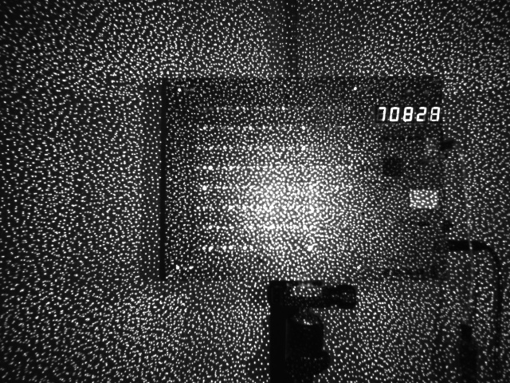

# 在 Gemini330 系列相机中使用 interleave_ae

> 本节介绍如何在 Gemini 330 系列相机中使用 interleave_ae（相机固件最低版本 [1.4.00](https://www.orbbec.com/docs/g330-firmware-release/)）

## 参数介绍

interleave_ae 相关参数在 [gemini_330_series.launch.py](https://github.com/orbbec/OrbbecSDK_ROS2/blob/v2-main/orbbec_camera/launch/gemini_330_series.launch.py) 中设置

* `interleave_ae_mode`：设置激光或 hdr 交错。

* `interleave_frame_enable`：启用交错帧模式。

* `interleave_skip_enable`：启用跳帧模式。

* `interleave_skip_index`：设置为 0 跳过图案 ir，设置为 1 跳过泛光 ir。

**interleave hdr**

当 `interleave_ae_mode` 参数设置为 `hdr` 且 `interleave_frame_enable` 设置为 `true` 时，将启用 interleave hdr

* `hdr_index1_laser_control`：帧 1 激光开关设置。

* `hdr_index1_depth_exposure`：帧 1 深度曝光值设置，非 AE 模式。

* `hdr_index1_depth_gain`：帧 1 深度增益值设置，非 AE 模式。

* `hdr_index1_ir_brightness`：帧 1 ir 增益值设置。

* `hdr_index1_ir_ae_max_exposure`：AE（自动曝光）中帧 1 ir 最大曝光值设置。

* `hdr_index0_laser_control`：帧 0 激光开关设置。

* `hdr_index0_depth_exposure`：帧 0 深度曝光值设置，非 AE 模式。

* `hdr_index0_depth_gain`：帧 0 深度增益值设置，非 AE 模式。

* `hdr_index0_ir_brightness`：帧 0 ir 增益值设置。

* `hdr_index0_ir_ae_max_exposure`：AE（自动曝光）中帧 0 ir 最大曝光值设置。

**interleave laser**

当 `interleave_ae_mode` 参数设置为 `laser` 且 `interleave_frame_enable` 设置为 `true` 时，将启用 interleave laser

* `laser_index1_laser_control`：帧 1 激光开关设置。

* `laser_index1_depth_exposure`：帧 1 深度曝光值设置，非 AE 模式。

* `laser_index1_depth_gain`：帧 1 深度增益值设置，非 AE 模式。

* `laser_index1_ir_brightness`：帧 1 ir 增益值设置。

* `laser_index1_ir_ae_max_exposure`：AE（自动曝光）中帧 1 ir 最大曝光值设置。

* `laser_index0_laser_control`：帧 0 激光开关设置。

* `laser_index0_depth_exposure`：帧 0 深度曝光值设置，非 AE 模式。

* `laser_index0_depth_gain`：帧 0 深度增益值设置，非 AE 模式。

* `laser_index0_ir_brightness`：帧 0 ir 增益值设置。

* `laser_index0_ir_ae_max_exposure`：AE（自动曝光）中帧 0 ir 最大曝光值设置。

## 运行启动文件

设置 interleave_ae 参数，重新 `colcon build` 并运行启动文件

```bash
ros2 launch orbbec_camera gemini_330_series.launch.py
```

**示例可视化**




## Multi_camera_synced + Interleave_ae

请参考 [multi_camera_synced](./multi_camera_synced.md) 和 [参数介绍](#参数介绍)
