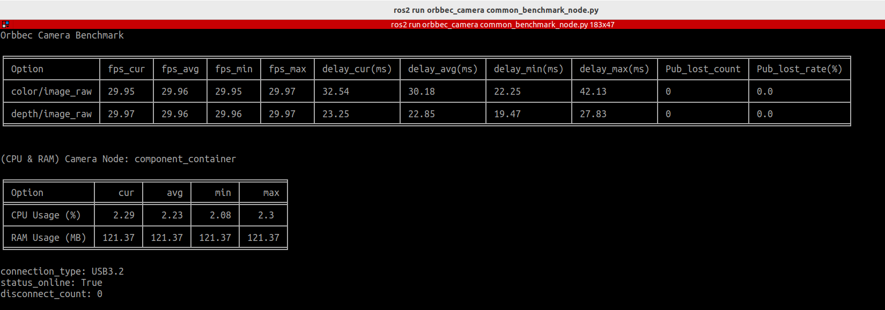
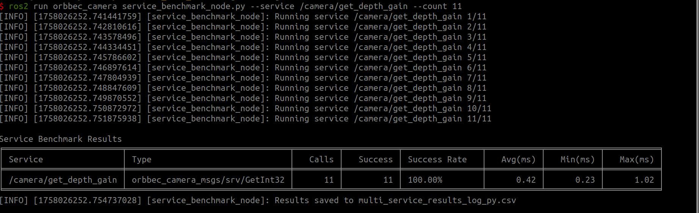

# 介绍

本节介绍性能基准测试工具，解释其目的、功能以及它可以帮助您测量的内容。

## 通用基准测试节点

`common_benchmark_node.py` 是一个用于监控在 ROS 环境中运行的 Orbbec 相机性能的工具。它实时收集和记录关键相机指标，如帧率、延迟、系统资源使用和丢包率，帮助用户评估相机节点的稳定性和性能（每秒更新一次）。

**功能**

- 测量发布的图像帧率和延迟（当前、最小、最大、平均）

- 监控相机节点的 CPU/ARM 使用率（当前、最小、最大、平均）

- 跟踪丢帧率（发布者）和丢包率（订阅者）

- 将实时统计信息（1 Hz）打印到终端并将结果保存到 CSV 文件

- 支持可配置的运行时长和 CSV 输出路径

**示例**

在 ROS1 中，可以测量丢帧率和丢包率，而在 ROS2 中，header 缺少 `seq` 字段，因此仅计算发布者端的丢帧率。

## 服务基准测试节点

`service_benchmark_node` 工具用于监控服务调用的性能。它可以测量服务调用的成功率和执行服务所需的时间。

**功能**

- 对单个服务调用进行基准测试，测量延迟和成功率

- 对 YAML 配置文件中定义的多个服务进行基准测试

- 可选择将基准测试结果保存到 CSV 文件

**示例**

当您需要收集多个服务的数据时，建议使用 CSV 文件进行分析。
