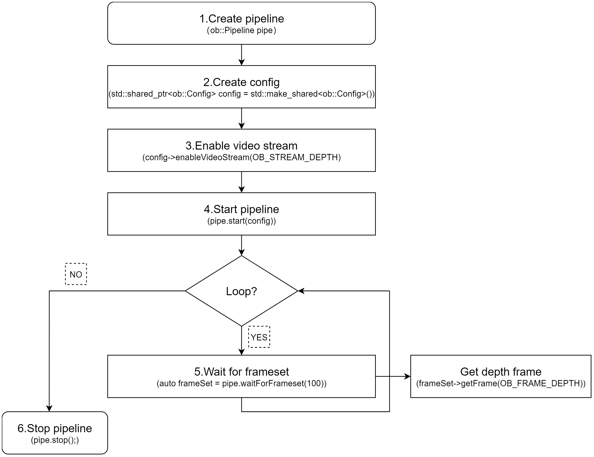

# Orbbec SDK 概述

本节介绍 C++ 版本的 Orbbec SDK。其架构和概念与 Python 包装器一致。

## 术语

|  序号  |  名称  |  说明  |
| --- | --- | --- |
|  1  |  USB  |  通用串行总线（Universal Serial Bus）  |
|  2  |  UVC  |  USB 视频类（USB Video Class）  |
|  3  |  Firmware  |  3D 相机的固件  |
|  4  |  Disparity  |  视差是指从两个有一定距离的点观察同一目标时的方向差异。  |
|  5  |  D2D (Disparity to depth)  |  视差转深度是一种图像处理技术，用于将视差信息转换为深度信息。  |
|  6  |  Hardware D2D  |  视差转深度在设备内部实现，不占用主机的计算能力。  |
|  7  |  Software D2D  |  视差转深度，在 Orbbec SDK 中实现  |
|  8  |  Depth point cloud  |  深度点云，三维世界坐标系中点的坐标，可以使用深度相机的内参转换为点云。  |
|  9  |  RGBD point cloud  |  叠加了 RGB 信息的点云  |
|  10  |  D2C  |  "深度到彩色"（Depth to Color）是一种对深度图像进行逐像素几何变换的功能。其结果是通过 D2C 变换将深度图像与其对应的彩色图像对齐，使我们能够通过在变换后的深度图像中使用相同图像坐标位置来定位彩色像素的深度信息。经过 D2C 变换后，我们生成一个与目标彩色图像大小相同的深度图像，其中图像内容表示彩色相机坐标系中的深度数据。换句话说，它重建了一个使用彩色相机的原点和尺寸"拍摄"的深度图像，其中每个像素与彩色相机的相应像素坐标匹配。  |
|  11  |  Hardware D2C  |  硬件 D2C 是指在相机内部执行深度到彩色变换的功能，相机直接输出 D2C 变换的结果。  |
|  12  |  Software D2C  |  使用 SDK 在主机端执行 D2C 计算。  |
|  13  |  Frame aggregation (FrameSet)  |  帧聚合，将深度、红外和彩色帧组合成一个帧集（Frameset），并通过管道调用。  |
|  14  |  C2D  |  "彩色到深度"（Color to Depth）是一种对彩色图像进行逐像素几何变换的功能。其结果是通过 C2D 变换将彩色图像与其对应的深度图像对齐。  |
|  15  |  MetaData  |  帧元数据是一组参数（或属性），提供了帧生成时传感器配置和/或系统状态的快照。  |
|  16  |  HDR  |  高动态范围（High Dynamic Range，HDR）成像允许成像系统在极暗和极亮的场景中拍摄图像。我们提出了一种在主机 CPU 上运行的软件解决方案来实现此功能。它利用两个连续帧的数据，直接合成这两个深度图像，从而增强 16 位深度图像的动态范围。  |
|  17  |  LDP  |  激光近距离保护（Laser close-range protection）  |

## Orbbec SDK v2 架构概述

- 应用层（Application）

OrbbecViewer、示例程序和用户应用程序实现。

- 接口和封装层（Interfaces and Encapsulation Layer）

OrbbecSDK 接口封装和包装器封装。

- 高级层（High-level Layer）

HighLevel 封装了核心业务组件，并使用管道（pipeline）向外部提供接口。

- 基础业务层（Basic business layer）

核心业务逻辑框架的实现。

- 平台抽象层（Platform abstraction layer）

跨平台组件抽象操作系统差异，提供统一的访问接口。

- 平台实现层（Platform implementation layer）

各平台的驱动实现。

## SDK 概念概述

- Context（上下文）

上下文提供一组设置，包括设备状态更改回调、日志级别等设置。Context 可以访问多个设备。

- Device（设备）

一个实际的硬件设备对应一个 Device 对象，用于获取设备的相关信息并控制其属性。

- Pipeline（管道）

HighLevel 对应的对象，封装了快速访问 SDK 的接口。它具有简单的功能，使用户能够快速上手并使用 SDK。

- Config（配置）

提供启用数据流、对齐模式和帧聚合模式的配置，用于控制数据输出的行为。

- StreamProfile（流配置）

流配置定义分辨率、帧率和编码格式等参数，还提供相机参数的管理。

- Frame（帧）

表示流中的一帧数据，还包含该帧数据的相关信息，如时间戳、类型等。

- Filter（滤镜）

主要指用于复合流 FrameSet 的一些算法处理模块，如点云算法处理。

- Record（录制）

录制功能，捕获数据流并将其保存为文件，以便后续分析或回放。

- Playback（回放）

回放功能，播放录制的文件，并支持控制回放速度和其他相关参数。

## SDK 编程模型

以下是 C++ 编程逻辑流程图。Python 的编程逻辑与之相同。

- 标准流程图：

标准流程图演示了如何从设备列表创建设备、设置和获取参数，以及应用后处理滤镜。

- 使用默认配置的流程图（基于 OrbbecSDKConfig.xml 中的默认设置获取流）：

