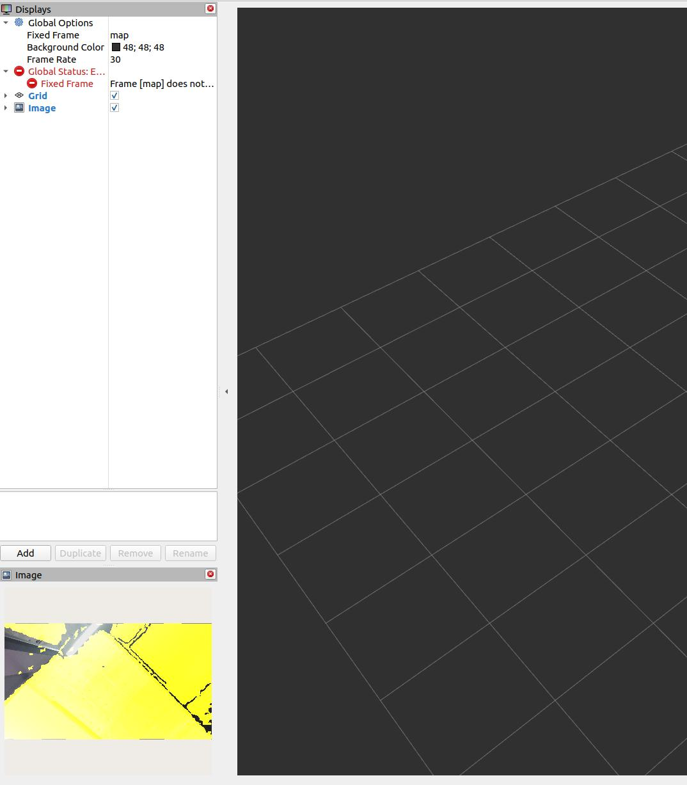

## 在 ROS 2 中对齐深度到彩色

本节说明如何使用 ROS 2 将深度图像与彩色图像对齐以创建叠加图像。这对于需要来自不同传感器模态的同步视觉信息的应用特别有用。

### 对齐和查看深度和彩色图像的命令

1. **基本深度到彩色对齐：**

   要简单地将深度图像对齐到彩色图像，请使用以下命令：

   ```bash
   ros2 launch orbbec_camera gemini_330_series.launch.py depth_registration:=true
   ```

   此命令激活深度配准功能，但不打开查看器。

2. **查看深度到彩色叠加：**

   如果您希望查看深度到彩色叠加，需要使用以下命令启用查看器：

   ```bash
   ros2 launch orbbec_camera gemini_330_series.launch.py depth_registration:=true enable_d2c_viewer:=true
   ```

   这将启动带有深度到彩色配准的相机节点并打开查看器以显示叠加图像。

### 在 RViz2 中选择话题

要在 RViz2 中可视化对齐的图像：

1. 运行上述命令之一后启动 RViz2。
2. 选择深度到彩色叠加图像的话题。话题选择示例如下所示：

   

### 深度到彩色叠加示例

在 RViz2 中选择适当的话题后，您将能够看到深度到彩色叠加图像。它可能看起来像这样：


