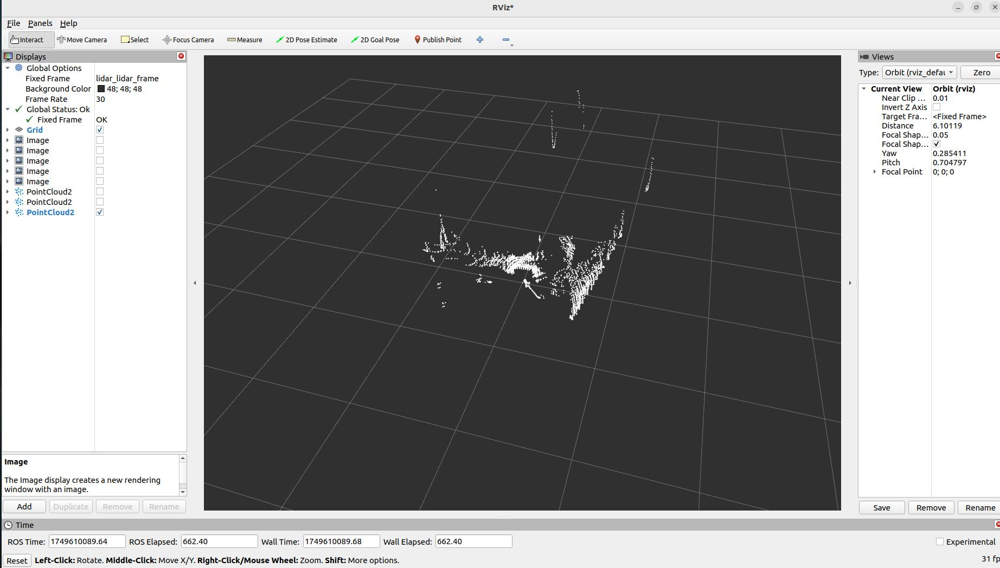

本ROS2驱动支持您使用奥比中光单线/多线激光雷达。本文档提供安装说明、使用指南和其他重要信息，帮助您快速开始使用此驱动。

## 安装

### 先决条件

在使用OrbbecSDK ROS2 LiDAR驱动程序之前，请确保您的系统上安装了以下依赖项：

- **ROS2**：Humble、Jazzy 或其他受支持的发行版。
  - 如果您需要帮助，请参阅[ROS2安装指南](https://docs.ros.org/en/foxy/Installation.html)。

### 安装deb依赖项

```bash
# 假设您已经配置了ROS环境，下同
sudo apt install libgflags-dev nlohmann-json3-dev  \
ros-$ROS_DISTRO-image-transport ros-${ROS_DISTRO}-image-transport-plugins ros-${ROS_DISTRO}-compressed-image-transport \
ros-$ROS_DISTRO-image-publisher ros-$ROS_DISTRO-camera-info-manager \
ros-$ROS_DISTRO-diagnostic-updater ros-$ROS_DISTRO-diagnostic-msgs ros-$ROS_DISTRO-statistics-msgs \
ros-$ROS_DISTRO-backward-ros libdw-dev
```

### 安装udev规则

```bash
cd  ~/ros2_ws/src/OrbbecSDK_ROS2/orbbec_camera/scripts
sudo bash install_udev_rules.sh
sudo udevadm control --reload-rules && sudo udevadm trigger
```

### 构建包

```bash
cd ~/ros2_ws/
# 构建发布版本，默认为调试版本
colcon build --event-handlers  console_direct+  --cmake-args  -DCMAKE_BUILD_TYPE=Release
```

### 启动激光雷达节点

* 第一个终端

```bash
. ./install/setup.bash
ros2 launch orbbec_camera lidar.launch.py
```

* 第二个终端

```bash
. ./install/setup.bash
rviz2
```

1. 打开Rviz2。
2. 添加 `PointCloud2`或 `LaserScan`显示。
3. 对于 `PointCloud2`，选择 `/lidar/cloud/points`话题；对于 `LaserScan`，选择 `/lidar/scan/points`话题。
4. 将 `Fixed Frame`设置为 `lidar_lidar_frame`以正确对齐数据。

* `PointCloud2`可视化示例：



* `LaserScan`可视化示例：


## 使用方法

### 运行驱动

要启动驱动，请启动提供的ROS2启动文件：

```bash
source install/setup.bash
# 启动带有点云数据的驱动
ros2 launch orbbec_camera lidar.launch.py lidar_format:=LIDAR_POINT
# 启动带有球面点云数据的驱动
ros2 launch orbbec_camera lidar.launch.py lidar_format:=LIDAR_SPHERE_POINT
# 启动带有激光扫描数据的驱动
ros2 launch orbbec_camera lidar.launch.py lidar_format:=LIDAR_SCAN
# 启动启用IMU的驱动
ros2 launch orbbec_camera lidar.launch.py enable_imu:=true imu_rate:=50hz
# 启动同时包含点云和IMU数据的驱动
ros2 launch orbbec_camera lidar.launch.py lidar_format:=LIDAR_POINT enable_imu:=true imu_rate:=100hz
```

此命令将启动与奥比中光激光雷达设备接口的节点。请确保在运行此命令之前正确连接激光雷达硬件。

### 获取已连接激光雷达的设备信息

```bash
ros2 run orbbec_camera list_devices_node
```

此命令将列出已连接的激光雷达设备并显示其各自的IP地址和端口。您可以使用此信息配置驱动以连接到特定设备。

### 检查激光雷达支持的配置

```bash
ros2 run orbbec_camera list_camera_profile_mode_node
```

### 2.4 参数和配置

`lidar.launch.py`文件包含驱动的默认参数。您可以通过修改启动文件或创建自定义配置文件来自定义这些设置。关键参数包括：

- **device_type**: 要启动的设备类型。可选值：`lidar`、`camera`。将此参数设置为 `lidar`启动激光雷达设备，设置为 `camera`启动摄像头设备。
- **camera_name**: 启动节点命名空间。
- **device_num**: 设备数量。如果需要启动多个设备，则必须填写此项。
- **upgrade_firmware**: 固件升级功能。输入参数是固件路径。
- **connection_delay**: 重新打开设备的延迟时间（毫秒）。在热插拔期间立即重新打开设备可能导致固件崩溃。
- **publish_tf**: 启用TF发布。
- **tf_publish_rate**: TF发布频率。
- **lidar_format**: 激光雷达的数据格式。可选值：`LIDAR_POINT`、`LIDAR_SPHERE_POINT`、`LIDAR_SCAN`
- **lidar_rate**: 激光雷达的扫描频率。
- **publish_n_pkts**: 多帧数据合并发布的帧数量。范围：1-12000。仅在激光雷达格式为 `LIDAR_POINT` 或 `LIDAR_SPHERE_POINT` 时生效，用于累积指定数量的帧后再发布合并的点云数据。默认值：`1`
- **enable_scan_to_point**: 启用扫描数据到点云数据的转换，发布PointCloud2数据类型话题。
- **repetitive_scan_mode**: 重复扫描模式参数。
- **filter_level**: 添加过滤级别参数。
- **vertical_fov**: 垂直角度参数。
- **min_angle**: 激光雷达扫描范围的最小角度（度）（例如，`-135.0`）。默认值：`-135.0`
- **max_angle**: 激光雷达扫描范围的最大角度（度）（例如，`135.0`）。默认值：`135.0`
- **min_range**: 激光雷达可测量的最小距离（米）。默认值：`0.05`
- **max_range**: 激光雷达可测量的最大距离（米）。默认值：`30.0`
- **echo_mode**: 激光雷达的回波模式。可选值：`Last Echo`、`First Echo`
- **point_cloud_qos**: ROS 2消息服务质量（QoS）设置。可能的值包括 `SYSTEM_DEFAULT`、`DEFAULT`、`PARAMETER_EVENTS`、`SERVICES_DEFAULT`、`PARAMETERS`和 `SENSOR_DATA`，不区分大小写。这些值分别对应 `rmw_qos_profile_system_default`、`rmw_qos_profile_default`、`rmw_qos_profile_parameter_events`、`rmw_qos_profile_services_default`、`rmw_qos_profile_parameters`和 `SENSOR_DATA`。
- **enumerate_net_device**: 启用网络设备的自动枚举。
- **net_device_ip**: 网络设备的IP地址。
- **net_device_port**: 网络端的端口号。
- **log_level**: SDK日志级别，默认值为 `none`，可选值为 `debug`、`info`、`warn`、`error`、`fatal`
- **time_domain**: 设备的时间戳类型。可选值为 `device`、`global`、`system`
- **config_file_path**: YAML配置文件的路径。默认值为""。如果未指定配置文件，将使用启动文件中的默认参数。
- **enable_heartbeat**: 启用心跳功能，默认为 `false`。如果设置为 `true`，相机节点将向固件发送心跳信号；如果需要硬件日志记录，也应将其设置为 `true`。
- **enable_imu**: 启用IMU（加速度计+陀螺仪）并输出统一的IMU话题数据。
- **imu_rate**: IMU的统一频率（加速度计和陀螺仪）。
- **accel_range**: 加速度计的量程。
- **gyro_range**: 陀螺仪的量程。
- **linear_accel_cov**: 线性加速度协方差值，默认为 `0.0001`。
- **angular_vel_cov**: 角速度协方差值，默认为 `0.0001`。

## 点云数据详细说明

### 点云格式

PointCloud2 (PointXYZITO) 点云格式如下：

```
float32 x               # X轴，单位：米
float32 y               # Y轴，单位：米
float32 z               # Z轴，单位：米
uint8   intensity       # 激光雷达强度
uint8   tag             # 激光雷达标签
uint32  offset_time     # 点云相对话题时间的偏移量，单位纳秒
```

### 点云聚合功能

通过 `publish_n_pkts` 参数可以开启点云聚合功能，该功能允许激光雷达在发布数据前累积指定数量的帧，然后将这些帧合并为一个更大的点云数据包进行发布。

#### 功能特点：

- **参数范围**: 1-12000 帧
- **适用格式**: 仅在激光雷达格式为 `LIDAR_POINT` 或 `LIDAR_SPHERE_POINT` 时有效
- **默认值**: 1（即不聚合，每帧单独发布）
- **用途**: 提高点云密度，适用于需要更密集点云数据的应用场景

#### 使用示例：

```bash
# 聚合10帧数据后发布
ros2 launch orbbec_camera lidar.launch.py lidar_format:=LIDAR_POINT publish_n_pkts:=10

# 聚合100帧数据后发布
ros2 launch orbbec_camera lidar.launch.py lidar_format:=LIDAR_SPHERE_POINT publish_n_pkts:=100
```

**注意**: 增加 `publish_n_pkts` 值会提高点云密度，但同时会增加延迟和内存使用量，请根据实际应用需求进行调整。

## IMU数据

### IMU话题

启用IMU时，将发布以下话题：

- **`/lidar/imu/sample`**: 统一的IMU话题，包含 `sensor_msgs/Imu`格式的同步加速度计和陀螺仪数据。
- **`/lidar/lidar_to_imu`**: 从激光雷达坐标系到IMU坐标系的变换。

### 使用IMU数据

要启用IMU数据采集：

```bash
# 启动并启用IMU
ros2 launch orbbec_camera lidar.launch.py enable_imu:=true imu_rate:=50hz

# 检查IMU话题
ros2 topic list | grep imu

# 查看IMU数据
ros2 topic echo /lidar/imu/sample
```

IMU数据包括：

- **linear_acceleration**: 3D加速度数据（x、y、z），单位：m/s²
- **angular_velocity**: 3D角速度数据（x、y、z），单位：rad/s
- **orientation**: 四元数方向（硬件不提供，设置为零）
