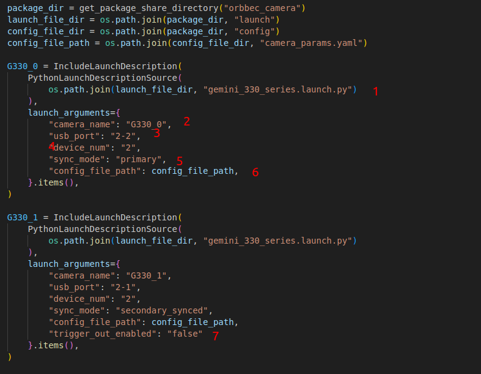

# Multi_camera synced Instructions

> The purpose of this document is to explain how to use multi-camera synced with OrbbecSDK_ROS2

## Setup instructions

* Please read the Multi-Camera Synchronization Setup Guide:[Multi-Camera Synchronization Setup](https://www.orbbec.com/docs/set-up-cameras-for-external-synchronization_v1-2/)
* Make sure the camera is correctly connected to the multi-camera synchronizer.


### Checking camera port with OrbbecSDK_ROS2

```bash
ros2 run orbbec_camera list_devices_node
```

### OrbbecSDK_ROS2 multi-camera synced configuration

Open multi_camera_synced.launch.py, and configure the camera settings as shown below:



1. `gemini_330_series.launch.py` is the launch file for starting the camera.
2. Set `camera_name` to `G330_0`. For example, the published color image topic will be `/G330_0/color/image_raw`.
3. Set `usb_port` to `2-2`, indicating that the camera device on port `2-2` is being used. This value can be found in the output of the `ros2 run orbbec_camera list_devices_node` command.
4. Set `device_num` to `2`, meaning two cameras will be used.
5. Set `sync_mode` to `primary` to indicate that the `2-7` camera device is in primary mode. The multi-camera sync mode options can be found in the figure below.
6. Parameters from the `config_file_path` can override the parameters set in `gemini_330_series.launch.py` (optional).
7. For slave cameras, set trigger_out_enabled to false.

| **Pattern Nam**e | **Setting effect description**                                                                                                                                                                                                                                                                                                                                                                                                                                                                 |
| ---------------------- | ---------------------------------------------------------------------------------------------------------------------------------------------------------------------------------------------------------------------------------------------------------------------------------------------------------------------------------------------------------------------------------------------------------------------------------------------------------------------------------------------------- |
| free_run               | -Support different frame rate settings<br />The -8-pin synchronization interface does not support external output of synchronization-related signals                                                                                                                                                                                                                                                                                                                                                 |
| standalone(default)    | ●        Same as Primary by default<br />●        Built-in RGBD frame synchronization<br />●        8-pin synchronous interface does not output signals to the outside by default                                                                                                                                                                                                                                                                                                                 |
| primary                | ●        Set as primary camera<br />●        8-pin synchronous interface output signal to external device                                                                                                                                                                                                                                                                                                                                                                                          |
| secondary              | ●        Set as secondary (passive synchronization; When there is a hardware continuous trigger signal input from the outside and the continuous trigger signal matches the currently set frame rate, the image is collected according to the external trigger signal; When there is no external trigger signal, the flow is stopped)<br />●        8-pin synchronous interface output signal to external device                                                                                   |
| secondary_synced       | ●        Set to secondary synchronization (passive synchronization; When there is a hardware continuous trigger signal input from the outside and the continuous trigger signal matches the currently set frame rate, the image is collected according to the external trigger signal; When there is no external trigger signal, the image is collected according to the internal trigger signal at the set frame rate)<br />●        8-pin synchronous interface output signal to external device |
| hardware_triggering    | ●        Set as hardware trigger (passive trigger; When there is a hardware trigger signal input from the outside and the trigger signal time interval is not less than the current upper limit, the image is collected according to the external trigger signal; When there is no external trigger signal, the image is not collected)<br />●        8-pin synchronous interface output signal to external device                                                                                 |
| software_triggering    | ●        Set as software trigger (passive trigger; When there is a trigger command input from the host computer and the trigger command time interval is not less than the current upper limit, the image is collected according to the trigger command; When there is no trigger command, the image is not collected)<br />●        8-pin synchronous interface output signal to external device                                                                                                  |

* The master camera should be launched last.
* Ideally, there should be a 2-second delay between starting each camera.

### Run the following command to start the multi-camera synced

```bash
ros2 launch orbbec_camera multi_camera_synced.launch.py
```
